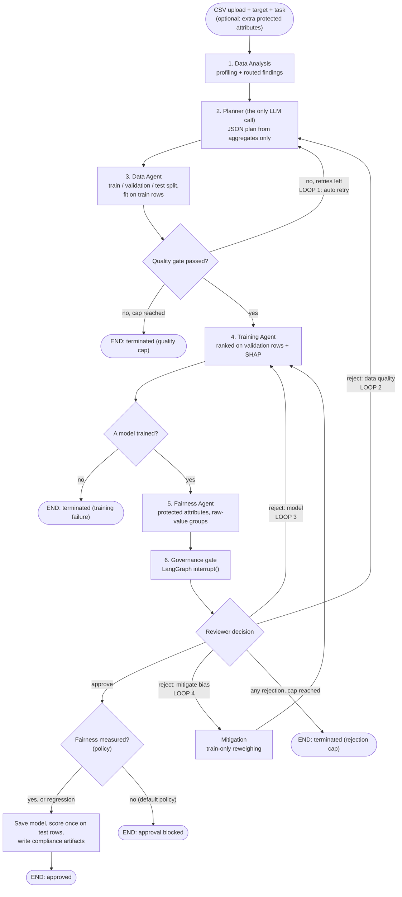
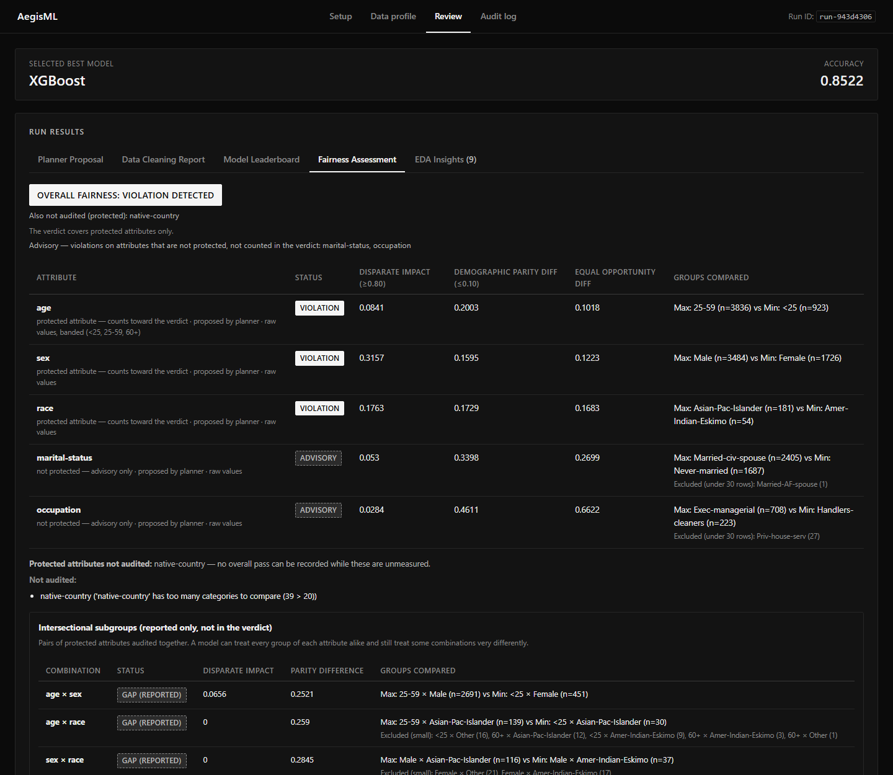

# AegisML — Governed AutoML for Tabular Data

**Project README: everything built so far, what changed from the original repository, and
every remaining next step.**

*Status as of 16 September 2026 · fork [`chenduran-nag/AegisML`](https://github.com/chenduran-nag/AegisML)
`main` at `ec83f65` plus this documentation update · original
[`ruhannpn/AegisML`](https://github.com/ruhannpn/AegisML) at `01c8c7d` · Semester 7 academic
project*

---

## Contents

1. [What AegisML is](#1-what-aegisml-is)
2. [Architecture](#2-architecture)
3. [Features in detail](#3-features-in-detail)
4. [Evaluation: do the governance loops change outcomes?](#4-evaluation-do-the-governance-loops-change-outcomes)
5. [Setup and running](#5-setup-and-running)
6. [Repository structure](#6-repository-structure)
7. [Tests](#7-tests)
8. [Design rules the code enforces](#8-design-rules-the-code-enforces)
9. [What this project does not claim](#9-what-this-project-does-not-claim)
10. [Changes from the original repository](#10-changes-from-the-original-repository)
11. [Next steps](#11-next-steps)

---

## 1. What AegisML is

Upload a CSV, pick a target column, and AegisML runs a chain of agents over it:

1. **profiles** the data and routes what it finds to the stage allowed to act on it,
2. has an LLM **plan** the preprocessing, from aggregate statistics only,
3. **cleans and splits** the data into train, validation and test rows, fitting everything on
   train rows only,
4. **trains** a model leaderboard ranked on the validation rows and explains the winner with SHAP,
5. **audits fairness** on protected attributes, and reports combined subgroups,
6. **stops for a human decision**: approve, reject, or ask for bias mitigation.

Approving saves the model, scores it **once on the untouched test rows**, and writes a **model
card, an AI Bill of Materials and a draft EU AI Act Annex IV pack**. Every step is written to a
**hash-chained, tamper-evident audit log**, under the thresholds and rules in a versioned
**`policy.yaml`**. By default, a model whose fairness could not be measured cannot be approved.

The machine learning is deliberately ordinary. **The contribution is the governance layer**: a hard
trust boundary around the LLM, fairness measurement that does not overstate what it measured, typed
human feedback loops, a real mitigation option, evidence that can be verified, policy as code, and a
quantitative evaluation of whether any of it changes outcomes.

---

## 2. Architecture



State is checkpointed to SQLite (`pipeline_state.db`) with LangGraph's `SqliteSaver`, so a run
paused at the gate survives a server restart. Evidence lives in a separate database
(`audit_log.db`) that the orchestration framework never touches.

### Feedback loops

| Loop | Trigger | Goes back to | Cap (from `policy.yaml`) |
|---|---|---|---|
| **1** Automatic retry | The Data Agent's quality gate fails | Planner, with the failure reason | `max_retries`: 2 |
| **2** Reject — data quality | Reviewer, with optional notes | Planner, with the notes in the prompt | shared `max_human_reroutes`: 2 |
| **3** Reject — model | Reviewer | Training, with the current model excluded | shared |
| **4** Reject — mitigate bias | Reviewer | Mitigation, then training on the same candidates with weights | shared |

### Endings

A run ends **approved**, or terminated by the **quality cap**, a **training failure**, the
**rejection cap**, or the **approval block** (a classification model whose fairness verdict could
not be measured cannot be approved under the default policy). Counters live in their own graph
nodes, because LangGraph re-executes a node on resume. Every terminated run shows a "Run ended
without approval" banner with its reason.

---

## 3. Features in detail

### 3.1 Exploratory analysis with routed findings — `data_analysis_agent.py`, `eda_insights.py`

The first graph node profiles the raw data (types, nulls, cardinality, ranges, IQR outliers,
correlations, target distribution) and derives **structured findings**, each with a **route**:

| Route | Findings | Who acts |
|---|---|---|
| `data_agent` | per-row identifiers and free text, constant columns | Dropped deterministically before the split |
| `planner` | zero-inflated or outlier-heavy features, redundant pairs, skewed target | Sent to the LLM, which must address each by name |
| `reviewer` | suspected target leakage, **proxy variables** for protected attributes (Cramér's V / correlation ratio) | Shown to the human only — **never sent to the LLM** |

Reviewer findings are withheld from the LLM on purpose: if the planner read "X is a proxy for
sex", it could write "drop X", and the Data Agent would execute a fairness decision nobody approved.
Columns the reviewer declares protected at run start take part in proxy detection. On UCI Adult this
produces 9 findings, including `relationship` as a high-severity proxy for `sex` (Cramér's V 0.65).

### 3.2 Planner — `planner_agent.py`

- **The only LLM call.** Groq, `openai/gpt-oss-20b` by default (override with `GROQ_MODEL`), JSON
  mode, `temperature=0.2`, validated against required keys with one retry.
- **Aggregates only.** No raw rows ever enter a prompt; column metadata is capped at 40 columns.
- **Provenance.** Model id, prompt SHA-256s, token usage and attempts are recorded for the AIBOM.
- **Record/replay cache.** Replay never calls the LLM and raises `PlannerCacheMiss` on a miss, so a
  replayed evaluation can never silently contain a fresh plan.

### 3.3 Data Agent — `data_agent.py`

- **Split before fit.** After structural drops (columns over the missing-value limit, rows with no
  target, EDA-routed identifier and constant columns), a stratified **train / validation / test
  split (64 / 16 / 20)** is drawn. Imputation values, frequency maps, winsorisation bounds and the
  scaler are fitted on train rows only.
- **The split travels through state** as index labels; later stages reuse it exactly.
- **The plan is read, never executed.** `_parse_plan_steps` reads each clause separately, ignores
  hedged advice ("consider", "if …"), applies a verb only before a scope terminator, and matches
  column names longest-first. Each rule fixes a real planner phrasing that was once misread.
- **Encoding** is one-hot below the policy's cardinality limit and frequency encoding above it; one-hot
  names are sanitised so XGBoost can train on them. Every limit comes from `policy.yaml`.

### 3.4 Training Agent — `training_agent.py`

Trains the recommended models that the policy allows (LogisticRegression, RandomForest, XGBoost,
GradientBoosting; Ridge and Lasso for regression), ranks them **on the validation rows**, and
extracts top-5 SHAP features. It accepts sample weights for mitigation; evaluation stays unweighted.
`evaluate_model` scores the approved model once on the test rows. A run in which no model trains ends
instead of reaching the gate.

### 3.5 Fairness Agent — `fairness_agent.py`

- **Verdict metrics.** Disparate impact (violation below 0.80) and demographic parity difference
  (violation above 0.10), both from `policy.yaml`. Equal-opportunity and equalized-odds gaps are
  reported but do not change the verdict.
- **Measured at the gate on validation rows**, and again on the test rows after approval.
- **Groups come from raw uploaded values**, not the cleaned frame: scaling and encoding destroy group
  membership (COMPAS's 0/1 `sex` became a float, Adult's `occupation` a frequency). Missing values form
  a `(missing)` group; `age` is banded (<25, 25–59, 60+); groups under 30 rows are excluded and listed.
- **The verdict covers protected attributes only.** Protected means named like one (sex, gender, race,
  age, religion, nationality, disability…) or **declared by the reviewer** at run start (for opaque or
  combined columns such as German Credit's `personal_status`). Other attributes the planner proposes
  are audited and shown as **advisory**; they never fail a model.
- **Combined subgroups.** Every pair of evaluated protected attributes (`sex × race`, `age × sex`) is
  audited with the same rules and reported in its own table. Reported only, never in the verdict.
- **Three-state verdict.** `True`, `False` or `None`. `None` is **NOT EVALUATED** (no protected
  attribute could be measured) or **NOT FULLY EVALUATED** (no violation among audited protected
  attributes, but another protected attribute in the data could not be audited). It is never shown as
  a pass, and under the default policy it cannot be approved.
- **Proxy warnings** from the EDA are shown under the verdict, informationally.

### 3.6 Governance gate, approval and mitigation — `pipeline_graph.py`, `mitigation.py`

The gate assembles a review payload and calls `interrupt()`, with no side effects before it. The
reviewer chooses:

| Decision | Effect |
|---|---|
| **Approve** | Refused if fairness was not measured (default policy). Otherwise: model saved, scored once on test rows, compliance artifacts written |
| **Reject — data quality** | Loop 2: back to the planner with the reviewer's notes |
| **Reject — model** | Loop 3: retrain without the current model |
| **Reject — mitigate bias** | Loop 4: reweighing, then retrain the same candidates |

**Mitigation is reweighing** (Kamiran & Calders): each (group, label) cell gets P(group) × P(label) /
P(group, label), computed on **train rows only** with the Fairness Agent's own grouping.

- The attribute is chosen **deterministically**: the protected attribute with the lowest disparate
  impact among the violations. Advisory attributes are never reweighted; a second mitigation reweights
  the intersection.
- Chosen over Fairlearn: no new dependency, and the approved model stays an ordinary estimator, so
  SHAP, the saved artifact and the model card are unchanged and no protected attribute is needed at
  prediction time.
- Only per-cell weights are stored; the next gate shows **before against now**.

### 3.7 Governance policy — `policy.py`, `policy.yaml`

- **Controls** the Data Agent's missing-value and quality limits, the test and validation sizes, the
  fairness thresholds and minimum group size, the retry and rejection caps, an allowed-models list,
  and `block_approval_when_fairness_not_evaluated` (on by default).
- **Fails loudly.** Unknown keys, wrong types, out-of-range values and unknown model names raise
  `PolicyError`; the server refuses to start.
- **Recorded per run.** The validated policy, its `version` and a SHA-256 of its values live in state;
  a `policy_applied` event opens the audit trail; the final outcome, AIBOM and model card name it.
- **The approval block is enforced three times:** the gate payload withholds Approve and gives the
  reason, the API returns 409, and the graph ends a stray approve at `mark_approval_blocked`.

### 3.8 Tamper-evident audit log — `audit_log.py`

Each entry stores `entry_hash = SHA-256(canonical entry + previous entry's hash)`, written through
`log_audit_event()` only. `verify_audit_chain(run_id)` names the first broken entry.

| Detected | Not detected (stated plainly) |
|---|---|
| Editing any logged field | Truncating trailing entries |
| Deleting an entry from the middle | Deleting an entire run |
| Inserting or reordering entries | Wholesale recomputation of an unsigned chain |

### 3.9 Compliance artifacts — `compliance_artifacts.py`

On approval, `artifacts/<run_id>/` receives `model_card.md` / `.json`, `aibom.json` and
`technical_documentation.md`. The model card holds the gate metrics **and the final test-row
evaluation with its own fairness verdict**, the verdict scope, declared protected attributes, advisory
violations, combined subgroups, mitigation, EDA findings, the decision history, the governance policy
version and hash, and explicit limitations. The AIBOM records dataset and model hashes, library
versions, planner provenance, the audit-chain head and the policy version and hash. Nothing is written
by an LLM; missing values are marked `not recorded`. The digests are chained into the audit log, and the
API refuses (409) to serve a file that fails verification.

### 3.10 Dashboard — `static/index.html`



- **Pages:** Setup (new-run form, pipeline strip), Data profile (figures, routed findings, charts,
  column profile), Review (planner proposal, cleaning report, leaderboard, fairness assessment, EDA
  insights, mitigation before/after, decision panel, approved or terminated banner, artifacts with
  integrity badges), Audit log (chain verification and entries).
- **Black, white and silver.** Status is never carried by hue: a pass is a quiet outline, a violation or
  failure is inverted (black on white), and an uncertain state (advisory, not evaluated) is dashed; every
  status has a text label. System fonts, flat panels, no gradients, blur or emoji.
- **Deep links.** `#run=<id>&page=<setup|profile|review|audit>&tab=<tab>` opens a recorded run.
- **Honest wording.** Nothing says "deployed" or "immutable"; Approve is disabled with the policy's
  reason when blocked; a finished run keeps its evaluation tabs.
- **Escaped.** LLM output, uploaded column names and error messages are HTML-escaped (checked with
  injection probes).

### 3.11 API — `server.py` (FastAPI)

| Method | Route | Purpose |
|---|---|---|
| POST | `/api/pipeline/start` | Upload CSV (with optional `protected_attributes`), start a run under the loaded policy |
| POST | `/api/pipeline/resume` | Submit a decision; 409 if the policy blocks the approval |
| GET | `/api/pipeline/status/{thread_id}` | State, gate payload (or the last one), outcome, final test evaluation, policy |
| GET | `/api/pipeline/eda/{thread_id}` | EDA report and findings |
| GET | `/api/pipeline/audit/{thread_id}` | Audit trail and chain verification |
| GET | `/api/pipeline/artifacts/{thread_id}` | Artifact list, hashes, verification |
| GET | `/api/pipeline/artifact/{thread_id}/{filename}` | One artifact (409 if integrity fails) |

---

## 4. Evaluation: do the governance loops change outcomes?

`experiments/run_governance_eval.py` drives the **real compiled graph** with a scripted reviewer:
**4 datasets × 4 arms × 5 split seeds = 80 runs**, each under the committed `policy.yaml`. Datasets
(OpenML): UCI Adult (48,842 rows), German Credit (1,000), Bank Marketing (45,211), COMPAS (5,278).

| Arm | Scripted reviewer |
|---|---|
| **A** governance off | No automatic retry; approve at the first gate |
| **B** auto-retry | Automatic retry on; approve at the first gate |
| **C** fairness reviewer | While a violation remains and reroutes remain, reject and take the next-best model |
| **D** mitigation reviewer | As C, but each rejection is *reject and mitigate* (reweighing) |

Gate decisions use validation rows; **every number below is from the untouched test rows**, over
protected attributes only. Means over 5 seeds, **A/B · C · D**:

| Dataset | AUC (test) | Violated protected attributes | Min disparate impact | Max parity difference |
|---|---|---|---|---|
| UCI Adult | 0.926 · 0.877 · 0.923 | 3.0 · 3.0 · 3.0 | 0.018 · 0.034 · 0.073 | 0.246 · 0.250 · 0.202 |
| German Credit | — (all 20 runs blocked) | — | — | — |
| Bank Marketing | 0.746 · 0.724 · 0.742 | 1.0 · 1.0 · 1.0 | 0.177 · 0.146 · 0.239 | 0.127 · 0.206 · 0.083 |
| COMPAS | 0.724 · 0.666 · 0.709 | 4.0 · 3.6 · 3.2 | 0.184 · 0.364 · 0.416 | 0.619 · 0.391 · 0.231 |

**Findings**

1. **No approved model passed.** 60 of 80 runs were approved, and all 60 violated on a protected
   attribute. The other 20 — every German Credit run — ended with approval blocked by the policy.
2. **Taking the next-best model is not a fairness intervention.** Arm C rerouted 15 of 20 runs and
   never reduced the violated protected attributes, at a test-AUC cost of 0.022–0.058.
3. **Reweighing did more for much less, but no model became compliant.** Arm D: fewer violated
   attributes in 4 of 15 rerouted runs (all COMPAS), none worse, test AUC down only 0.003–0.015.
   COMPAS min disparate impact rose 0.18 → 0.42; Adult's rose 0.018 → 0.073.
4. **Small datasets leave the gate blind, so the policy refuses to approve.** On German Credit's
   160 validation rows no protected attribute could be audited on any seed. Before the approval block,
   reviewers approved those models, and the test rows then showed age violations on 3 of 5 seeds.
5. **Gate numbers are optimistic**, as expected: COMPAS 0.735 at the gate against 0.724 on test.
6. **Running the evaluation found real defects**, all fixed (section 10): XGBoost failing on German
   Credit, a model-less run reaching approval, a Fairness Agent that understated disparity, a verdict
   passing with a protected attribute unaudited, and a provenance flag that always read "dirty".

**Caveats:** advisory attributes (Adult `occupation`, `marital-status`) still show large disparities;
protected attributes are recognised by name unless declared, and the scripted reviewers declare
nothing; combined subgroups are not part of these numbers; COMPAS `sex` is coded 0/1 without
documentation; for COMPAS the positive class is the adverse outcome. The full list is in `README.md`,
and every table with standard deviations is in `experiments/results/summary.md`.


**Reproducible without an API key.** Planner responses are committed in `experiments/planner_cache/`;
the replay served 80/80 planner calls from cache with 0 errors.

---

## 5. Setup and running

```bash
git clone https://github.com/chenduran-nag/AegisML.git
cd AegisML
python -m venv .venv
# Windows: .venv\Scripts\activate      macOS/Linux: source .venv/bin/activate
pip install -r requirements.txt
```

**Run the tests** (offline, no key, no network):

```bash
pytest
```

**Run the dashboard.** Create `.env` at the repository root (gitignored — never commit it):

```env
GROQ_API_KEY=your_groq_api_key_here
```

```bash
python server.py
```

Then open http://localhost:8000. The server loads `policy.yaml` at startup and refuses to start if it
is invalid. On Windows, for live verification, run `python -m uvicorn server:app --port 8000` without
`--reload`: the reloader has been observed to keep serving stale code.

**Reproduce the evaluation** (no key needed; datasets download from OpenML on first use, about 16–27
minutes):

```bash
python experiments/run_governance_eval.py
```

**Rebuild only its tables and figure** from the saved CSVs, in seconds:

```bash
python experiments/run_governance_eval.py --summarise-only
```

Other options: `--arms A,C,D`, `--datasets adult,compas`, `--seeds 2`, `--quick` (subsampled smoke test
into the gitignored `experiments/results_quick/`, with `--cache-dir` pointing at a scratch folder),
`--mode record` (calls the LLM on cache misses).

---

## 6. Repository structure

```text
├── server.py                    FastAPI app and endpoints
├── pipeline_graph.py            LangGraph graph: nodes, routers, loops, approval block, checkpointer
├── graph_state.py               PipelineState TypedDict and serialisation helpers
├── data_analysis_agent.py       Raw profiling and chart payloads
├── eda_insights.py              Routed EDA findings, proxy/leakage detection, protected-attribute names
├── planner_agent.py             The only LLM call; provenance; record/replay cache
├── data_agent.py                Train/validation/test split, train-only fitting, plan-step parser
├── training_agent.py            Model registry, validation-row leaderboard, SHAP, sample weights, evaluate_model
├── fairness_agent.py            Raw-value groups, protected-only verdict, combined subgroups
├── mitigation.py                Reweighing mitigation
├── policy.py                    Policy loader: validation, version, SHA-256
├── policy.yaml                  Thresholds and governance rules
├── audit_log.py                 Hash-chained audit log and verification
├── compliance_artifacts.py      Model card, AIBOM, Annex IV draft, artifact verification
├── static/index.html            Dashboard
├── tests/                       Offline pytest suite (251 tests)
├── .github/workflows/tests.yml  Runs pytest on every push
├── experiments/
│   ├── run_governance_eval.py   Evaluation harness
│   ├── planner_cache/           Recorded planner responses (committed)
│   └── results/                 Committed results: runs, trajectory, summary, figures, manifest
├── images/                      Dashboard screenshots
├── README.md                    Main README
├── PROJECT_README.md            This document
├── CLAUDE.md                    Context and invariants for AI coding assistants
├── NEXT_STEPS.md                Detailed work plan with designs and acceptance criteria
├── PROJECT_REVIEW.md            Review, landscape scan, defect history, roadmap
├── requirements.txt, pytest.ini
├── app.py                       Superseded Streamlit UI (not extended)
├── dataset_utils.py, build_presentation.py, AegisML_Review2_Presentation.pptx
└── test_*.py                    Original manual scripts (live Groq and network; not run by pytest)
```

Created at runtime and gitignored: `.env`, `pipeline_state.db`, `audit_log.db`, `saved_models/`,
`artifacts/`, `experiments/.data_cache/`, `experiments/results_quick/`.

---

## 7. Tests

`pytest` runs **251 offline tests**: synthetic fixtures, a stubbed planner, no API key, no network.
GitHub Actions runs them on every push.

| File | Tests | Covers |
|---|---:|---|
| `test_eda_insights.py` | 56 | Finding routes, proxy detection, plan-step parsing against real planner phrasings, a captured prompt proving reviewer findings never reach the LLM |
| `test_governance_eval.py` | 44 | Record/replay cache, scripted reviewers for all arms, metrics, CSV round trip, summaries, charts |
| `test_fairness_groups.py` | 29 | Minimum group size, raw-value groups, age bands, protected-only verdict, declared attributes, coverage rule |
| `test_policy.py` | 25 | Policy validation and hashing, thresholds changing behaviour, approval block, regression exemption |
| `test_graph_end_to_end.py` | 19 | Interrupt/resume, every reroute loop, caps, training failure, model saving, artifacts, audit chain |
| `test_compliance_artifacts.py` | 18 | Artifact contents, NOT EVALUATED wording, digests, tamper detection |
| `test_leakage.py` | 13 | Split before fit; parameters learned from train rows only |
| `test_audit_chain.py` | 12 | Hash chain, edit/delete/reorder detection, the documented truncation gap |
| `test_mitigation.py` | 12 | Weight arithmetic, train-only fitting, attribute choice, the graph path, the model card |
| `test_validation_split.py` | 7 | Three-way split, gate on validation rows, one final scoring on test rows |
| `test_intersectional.py` | 6 | Combined subgroups: hidden disparities, small combinations, never in the verdict |
| `test_feature_names.py` | 5 | XGBoost-safe one-hot names |
| `test_fairness_honesty.py` | 3 | Unmeasured fairness never reported as passed |
| `test_completed_run.py` | 2 | A finished run keeps the payload its reviewer decided on |

---

## 8. Design rules the code enforces

1. **The LLM plans; it never touches data.** Its output is keyword-matched, never executed.
2. **Only aggregates go to the LLM.**
3. **Split before fit**, and the split travels through state as index labels.
4. **Unmeasured is not passed** — the verdict has three states and `None` never shows as a pass.
5. **The audit log is append-only.**
6. **The gate node has no side effects before `interrupt()`.**
7. **Only approved models reach disk**, and only real paths are shown.
8. **No per-row data in audit details.**
9. **Do not overclaim** — every guarantee states its limits.
10. **Reviewer-routed EDA findings never reach the LLM.**
11. **The Data Agent executes only unconditional plan instructions.**
12. **Compliance artifacts are generated from state, never authored.**
13. **A run with no trained model never reaches the gate.**
14. **Fairness groups come from raw values**; the verdict covers protected attributes only; combined
    subgroups and error-rate gaps are reported, never judged.
15. **Mitigation is reviewer-triggered, deterministic, train-only**, and only for protected attributes.
16. **Gate decisions use validation rows; test rows are scored once, after approval.**
17. **The run's policy governs it and is recorded**, and approving an unevaluated classification model
    is refused by default.

`CLAUDE.md` explains each rule and the defect that motivated it.

---

## 9. What this project does not claim

- **No compliance certification.** The architecture is designed against the control objectives of the
  EU AI Act, NIST AI RMF and similar frameworks; it has not undergone conformity assessment. The Annex
  IV document is a draft input, and says so.
- **The audit chain does not detect truncation, whole-run deletion or recomputation** (unsigned,
  unanchored).
- **No reviewer identity yet.** Anyone who can reach the resume endpoint can decide.
- **Fairness coverage is limited.** Protected attributes are recognised by column name unless declared;
  only age is banded; high-cardinality protected columns (Adult `native-country`) are not audited;
  combined subgroups do not affect the verdict; small datasets may not be auditable at the gate at all.
- **Mitigation improves but does not guarantee fairness**, and the evaluation shows it.

---

## 10. Changes from the original repository

**Baseline:** `ruhannpn/AegisML` at `01c8c7d` ("docs: Add interactive GitHub Mermaid DAG
flowchart"). The original repository has had **no new commits since**. All work is on the fork
`chenduran-nag/AegisML`; nothing has been pushed to the original.

**Totals through `ec83f65`:** 17 commits, 50 files changed, **+12,950 / −660 lines**; tests went from 0
automated (8 manual scripts needing a live API key and network) to **251 offline tests**. This
documentation update adds one commit and replaces the dashboard screenshots.

### 10.1 Commits

| Commit | Date | Change |
|---|---|---|
| `cc22712` | 11 Sep | Fix train/test leakage, save approved models, add hash-chained audit log |
| `f2c4742` | 11 Sep | Add `CLAUDE.md` project context and `NEXT_STEPS.md` work plan |
| `3cbba6e` | 14 Sep | Generate compliance artifacts on approval (model card, AIBOM, Annex IV draft) |
| `9111bbb` | 14 Sep | Fix three dashboard bugs found by live verification |
| `91544dc` | 14 Sep | Feed EDA insights into the pipeline via routed findings |
| `363ce53` | 14 Sep | Add quantitative governance evaluation |
| `ab2d12f` | 14 Sep | Make fairness metrics trustworthy and re-run the evaluation |
| `abff370` | 15 Sep | Do not record a fairness pass while a protected attribute is unaudited |
| `14e2fe0` | 15 Sep | Add reweighing mitigation as a gate decision, and arm D |
| `75b96c9` | 15 Sep | Re-run the evaluation with arm D |
| `e19c7bd` | 15 Sep | Base the fairness verdict on protected attributes, and let reviewers declare them |
| `8909818` | 15 Sep | Decide at the gate on validation rows; score the approved model once on test rows |
| `426f41b` | 15 Sep | Report intersectional subgroups; fix completed-run tabs, regression KPI and escaping |
| `d81faa2` | 15 Sep | Re-run the evaluation with the validation gate and protected-only verdict |
| `b2fd32b` | 15 Sep | Add policy-as-code, and block approving a model whose fairness was not measured |
| `f420d48` | 15 Sep | Re-run the evaluation under the governance policy; fix the dirty-tree check |
| `ec83f65` | 15 Sep | Restyle the dashboard in black, white and silver, and remove template UI |

### 10.2 Defects fixed

**Present in the original code:**

| # | Defect | Fix |
|---|---|---|
| 1 | **The model was never saved.** The API fabricated a path and the dashboard displayed it as a real file | Written in `audit_log_node`; only the real path is shown |
| 2 | **Train/test leakage.** Scaling and frequency encoding were fitted on all rows before the split | Split drawn first; all parameters fitted on train rows |
| 3 | **`requirements.txt` missed ~10 packages**; the quickstart could not work | Completed |
| 4 | **"Immutable" audit log was a plain table** — any edit was untraceable | SHA-256 hash chain + verification + badge |
| 5 | Fairness measured on all rows, including training rows | Held-out rows only |
| 6 | Graph compiled twice at import, leaking a SQLite connection | Duplicate removed |
| 7 | `graph.invoke()` blocked the server's event loop during training | `run_in_threadpool` |
| 8 | EDA cache held in memory, lost on restart | Moved into checkpointed state |
| 9 | Regression runs reported fairness **passed** without measuring anything | `None`, shown as NOT EVALUATED |
| 10 | README drift: wrong LLM and a token guardrail that did not exist | Aligned with code |
| 11 | Invalid CORS combination (`*` origins with credentials) | `allow_credentials=False` |
| 12 | Tests were print scripts needing live Groq and a download | Offline pytest suite |
| 16 | **Categorical encoding silently did nothing on pandas 3** — nothing could train | Dtype-aware predicate |
| 20 | **XGBoost failed on every German Credit fit** (one-hot names with `[`, `]`, `<`) | Names sanitised |
| 21 | A run whose candidates all failed to train reached the gate and could be approved | `route_after_training` ends it |
| 22 | Fairness groups read from the cleaned frame — COMPAS `sex` and Adult `occupation` never audited | Groups from raw values |
| 23 | No minimum group size — a 4-person group set Adult's disparate impact to 0.0 | Groups under 30 excluded and listed |
| 24 | `age` was proposed on every benchmark and never audited | Age bands |
| 27 | Planner output and uploaded column names were inserted into the dashboard unescaped | Escaped |
| 28 | The regression KPI read the upload form's toggle, not the run ("ACCURACY N/A") | Decided from the run's metrics |

**Found while building on it:**

| # | Defect | Fix |
|---|---|---|
| 17 | Terminated runs displayed "Model Formally Approved & Saved" | Separate terminated banner |
| 18 | A temporal-dead-zone error aborted the approved-path render | Declaration hoisted |
| 19 | The plan-step matcher dropped **both** columns of a redundant pair, and executed hedged advice | Clause, hedge and scope rules |
| 25 | Skipped fairness attributes were computed but never shown | "Not audited" list with reasons |
| 26 | A verdict read "passed" while a protected attribute in the data went unaudited | NOT FULLY EVALUATED |
| 29 | A completed run's evaluation tabs were empty | The gate keeps `last_review_payload` |
| 30 | On small datasets the gate could not audit any protected attribute, and reviewers approved blind | Approval of an unevaluated model blocked by policy |
| 31 | The evaluation's `git_dirty` flag counted its own result files, so it was always true | Results excluded from the check |
| — | A completed run's pipeline strip showed its stages as PENDING | Reads the kept payload |

### 10.3 New capabilities

- Hash-chained, verifiable audit log, opened by the governing policy
- Model card, AIBOM and Annex IV draft, with digests chained and verified
- EDA as the first graph node, with routed findings and proxy and leakage detection
- Planner provenance and a record/replay cache
- Robust plan-step parsing, winsorisation, identifier and constant-column drops
- Train / validation / test split, validation-row gate, one final scoring on untouched test rows
- Fairness overhaul: raw-value groups, minimum group size, age bands, protected-only verdict with advisory
  attributes, reviewer-declared protected attributes, combined subgroups, error-rate gaps, coverage-aware
  three-state verdict
- **Reject and mitigate** (reweighing) with a before/after view
- **Policy as code** with strict validation, per-run provenance and the approval block
- Training-failure and approval-blocked endings
- Quantitative governance evaluation: 4 datasets × 4 arms × 5 seeds, committed results, replayable without a key
- 251 offline tests and a GitHub Actions workflow
- Dashboard: black / white / silver restyle, deep links to runs, terminated and approved banners,
  artifacts panel, EDA insights, fairness table with protected and advisory labels, combined-subgroup
  table, mitigation card, disabled Approve with the policy's reason, HTML escaping throughout

### 10.4 Files

**New:** `eda_insights.py`, `compliance_artifacts.py`, `mitigation.py`, `policy.py`, `policy.yaml`,
`experiments/run_governance_eval.py`, `experiments/planner_cache/`, `experiments/results/`, `tests/`
(14 test files + `conftest.py`), `pytest.ini`, `.github/workflows/tests.yml`, `CLAUDE.md`,
`NEXT_STEPS.md`, `PROJECT_REVIEW.md`, `PROJECT_README.md`, and new dashboard screenshots in `images/`.

**Substantially changed:** `pipeline_graph.py`, `fairness_agent.py`, `data_agent.py`, `training_agent.py`,
`audit_log.py`, `planner_agent.py`, `server.py`, `static/index.html`, `graph_state.py`,
`requirements.txt`, `.gitignore`, `README.md`.

**Removed:** the original screenshots in `images/` (they showed the old dashboard).

**Unchanged from the original:** `data_analysis_agent.py`, `app.py`, `dataset_utils.py`,
`build_presentation.py`, the root `test_*.py` scripts, the Review 2 presentation.

### 10.5 Claims corrected

- "Immutable audit log" → **tamper-evident**, with what it does and does not detect.
- "Built in compliance with EU AI Act…" → designed against the control objectives; **no compliance claim**.
- "production-ready model" and "STATUS: DEPLOYED" removed from the dashboard: nothing is deployed.
- The LLM badge, token-guardrail description and saved-model path now match the code.

---

## 11. Next steps

Recommended order. `NEXT_STEPS.md` has the full design and acceptance criteria for each.

### Step 5 — reviewer identity and dual sign-off

- `reviewer_id` / `reviewer_role` on decisions, authenticated with per-reviewer tokens from a gitignored
  config, with the threat model stated honestly.
- Log the reviewer in the audit trail, the model card and the AIBOM (the approver is still `not recorded`).
- **Dual sign-off:** approving a model with a fairness violation requires a second, different reviewer.
  This is also the natural override for the approval block (a second reviewer accepting an unmeasured
  verdict, recorded as such). Make both policy flags.
- Replace `allow_origins=["*"]` with an explicit list before enabling credentials.

### Fairness and evaluation

- **Small datasets at the gate.** A policy-set validation size, or cross-validated fairness on train rows,
  so a dataset like German Credit can be audited before approval.
- **Policy keys** for the verdict scope and for whether error-rate gaps and combined subgroups count.
- **Select a policy per run** from the dashboard (for example `default` / `strict`).
- **Mitigation:** let the reviewer choose the attribute; consider in-training constraints for datasets
  where two reweighings cannot close the gaps.
- **High-cardinality protected columns** (Adult `native-country`): compare their large groups instead of
  skipping the attribute.
- Calibration by group; banding rules beyond age.

### Cleanups

- [ ] SVM is still recommendable by the planner and always skipped — removing it from the prompt waits for
      the next planner-cache re-record, because it changes every prompt hash.
- [ ] The target is label-encoded twice (Data Agent and Training Agent).
- [ ] Retire `app.py` and move the root `test_*.py` scripts — the partner's code, so agree first.
- [ ] **Audit-chain anchoring:** publish the head hash outside the database, or sign entries.

### Still open from earlier steps

- **EDA:** the planner recommends transforms the Data Agent cannot execute (binary indicators, `log1p`);
  proxy detection keys on names; hedged "drop X if present" is deliberately not executed.
- **Artifacts:** no cross-run model registry.

### Larger extensions (from the project review)

- **Post-deployment monitoring:** drift and decay detection that reopens the governance gate.
- **OpenTelemetry instrumentation** with the GenAI semantic conventions.
- **Counterfactual explanations** alongside SHAP.
- **LLM ablation** across planner models.
- **NIST AI RMF tagging** of audit events.

### Housekeeping

- In the original working folder, the git remote `origin` points to the partner's repository and `fork`
  to this one; rename them to match `CLAUDE.md`.
- Rotate the Groq API key that was shared in chat during development.
- When both partners agree, open a pull request from the fork to `ruhannpn/AegisML`.
