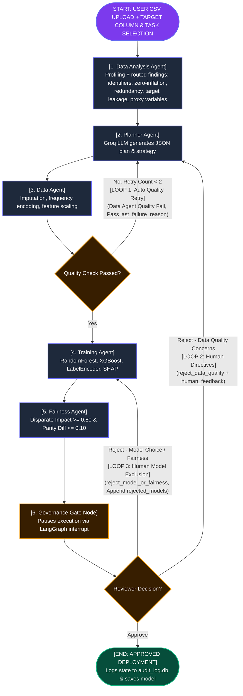
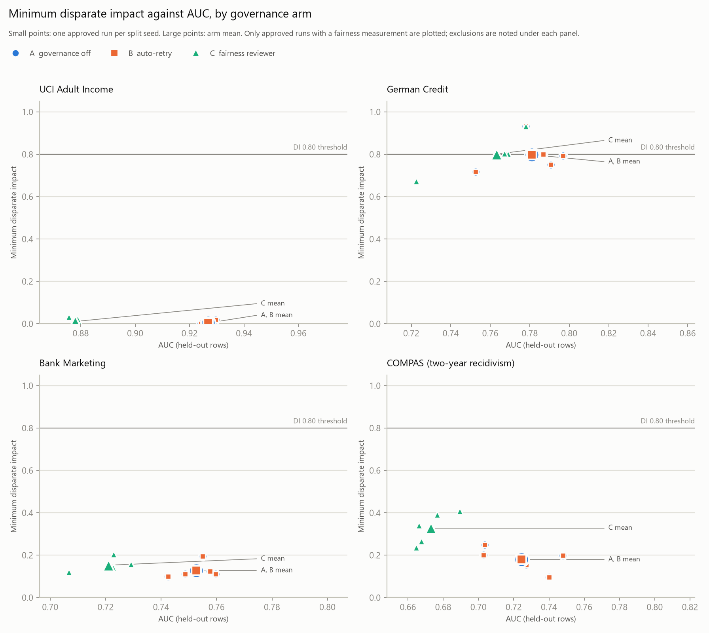

# AegisML: Autonomous Multi-Agent AI Data Science & Governance Platform

[](https://python.org)
[](https://fastapi.tiangolo.com)
[](https://langchain.com)
[](https://groq.com)
[](https://sqlite.org)

**AegisML** is an enterprise-grade, state-checkpointed multi-agent machine learning platform designed to bridge automated AI data science with human governance, algorithmic fairness auditing, and immutable compliance logging.

---

## 🌟 Architecture & Key Highlights

- **6 Specialized Pipeline Nodes**: Seamlessly orchestrates Exploratory Data Analysis, LLM Model Strategy Planning, Deterministic Data Cleaning, Ensemble Model Training & SHAP, Subgroup Fairness Auditing, and Governance Gate Interrupts.
- **State Checkpointing & Resumption**: Built on **LangGraph** with a persistent SQLite checkpointer (`pipeline_state.db`), enabling crash-recovery and zero-latency human-in-the-loop interrupts.
- **Human-in-the-Loop Governance Gates**: Pauses execution before model deployment to present evaluation reports to human auditors with custom prompt directive injection and model candidate exclusion.
- **3-Loop Resilience System**: Features automated quality retry loops and two interactive human reroute loops.
- **Tamper-Evident Audit Logger**: Every agent execution event, metric evaluation, and human reviewer decision is appended to `audit_log.db`, each entry SHA-256 hashed together with its predecessor. `verify_audit_chain()` re-derives the chain and reports the exact entry at which any edit, deletion or reordering occurred. See [Audit Chain Guarantees](#-audit-chain-what-is-and-is-not-guaranteed) for what this does and does not prove.
- **No Train/Test Leakage**: The train/test split is drawn by the Data Agent *before* any parameter is fitted. Imputation fill values, frequency-encoding maps and the feature scaler are all learned from the train rows only; fairness is measured on the held-out rows.

---

## 🔄 Multi-Agent DAG Topology & Looping Mechanics

### Pipeline Architecture Flowchart



### 6 Pipeline Agent Nodes

1. **`Data Analysis Agent` (`data_analysis_agent.py`, `eda_insights.py`)**: The first graph node. Profiles the raw data for the dashboard, then derives structured **findings**, each routed to the stage allowed to act on it. Structural issues (identifier and constant columns) go to the Data Agent, which drops them. Judgement-light issues (zero-inflated or outlier-heavy features, redundant pairs, a skewed target) go to the Planner, which must address each by name. Suspected target leakage and **proxy variables** for protected attributes (Cramér's V / correlation ratio) are held for the human reviewer and never sent to the LLM. Every finding is shown at the gate with what each stage actually did with it.
2. **`Planner Agent` (`planner_agent.py`)**: Uses Groq LLM (`openai/gpt-oss-20b` by default; override with the `GROQ_MODEL` env var) in JSON mode at `temperature=0.2`. Only aggregate statistics are sent — never raw rows. Column metadata is capped at 40 representative columns (target, sensitive and high-null columns prioritised) to stay inside the request size limit on wide datasets. The response is validated against 5 required keys, with one retry on parse failure.
3. **`Data Agent` (`data_agent.py`)**: Executes deterministic data cleaning. Drops columns above 50% missing and rows with a null target, then **draws the train/test split** and fits every subsequent parameter — median/mode imputation, frequency-encoding maps, `StandardScaler` — on the train rows only, applying them to all rows. Returns `train_index` / `test_index` so the Training Agent reuses the identical split.
4. **`Training Agent` (`training_agent.py`)**: Converts target `y` using `LabelEncoder` (0..N-1) for 100% XGBoost compatibility across binary and multi-class tasks. Fits ensemble models (`RandomForest`, `XGBoost`, `LogisticRegression`/`Ridge`), ranks leaderboards, and extracts top-5 SHAP feature importances.
5. **`Fairness Agent` (`fairness_agent.py`)**: Evaluates subgroup equity across demographic candidates (gender, race, age) on the **held-out test rows**, enforcing Disparate Impact ($\ge 0.80$) and Demographic Parity Difference ($\le 0.10$). One-hot-encoded attributes are reconstructed by prefix matching. Regression tasks and runs where no candidate resolves to a usable subgroup column return `overall_fairness_passed = None` with `fairness_evaluated = False` — reported in the dashboard as **NOT EVALUATED**, never as a pass.
6. **`Governance Gate Node` (`pipeline_graph.py`)**: Calls `interrupt(payload)`, pausing graph execution to present evaluation reports to human auditors on the web dashboard.

### 3-Loop Resilience System

- **Loop 1: Automated Data Quality Retry Loop**: If `Data Agent` detects `quality_check_passed == False` (e.g. unhandled missing values $>5\%$), it automatically loops back to `Planner Agent` (max 2x) passing `last_failure_reason`.
- **Loop 2: Human Data Directives Loop**: If a human reviewer selects **Reject (Data Quality)** with optional custom text directives (`human_feedback`), execution reroutes to `Planner Agent`, injecting instructions into the Groq LLM system prompt.
- **Loop 3: Human Model Exclusion Loop**: If a human reviewer selects **Reject (Model Choice / Fairness)**, the currently winning model is added to `rejected_models`, and execution reroutes to `Training Agent` to train and select the next best algorithm.

---

## 🖼️ Visual Feature Walkthrough

### 1. Dataset Upload & Pipeline Setup
Upload any tabular CSV dataset, select target column (with auto-detected classification or regression task type), and view real-time DAG node execution status.


---

### 2. Exploratory Data Profiling
Dedicated **Data Analysis & Profiling** dashboard page displaying summary KPI banners, column data types, null counts, cardinality, range, mean, std, and IQR outlier detection.


---

### 3. Interactive Data Analysis Visualizations (Chart.js)
Real-time visual chart panels rendering target class/value distribution histograms, top feature correlation strength bars, and data quality ratios.


---

### 4. LLM Model Strategy & Proposal
Groq LLM-generated plan displaying data quality concerns, recommended preprocessing steps, model algorithms, and sensitive attribute candidates.


---

### 5. Governance Gate & Human-in-the-Loop Decision Panel
Paused pipeline execution checkpoint giving human auditors 3 governance decision paths: **Approve**, **Reject Data Quality** (with custom text prompt directives), or **Reject Model Choice** (with candidate exclusion).


---

### 6. Resumed Execution & Pipeline State Progress
Real-time topology status updating as the graph resumes execution following a governance decision.


---

### 7. Approved Model Deployment & Disk Serialization
Formally approves the winning model. `audit_log_node` writes the serialised `.joblib` artifact to `saved_models/<run_id>_<model>.joblib` and records the real path in both the pipeline state and the audit entry; the dashboard displays that path, or an explicit **NOT SAVED** message with the failure reason. Serialisation happens only on the approve path — a model rejected at the gate never reaches disk.


---

### 8. Immutable Governance Audit Trail
Chronological event audit log persisted into SQLite (`audit_log.db`), recording agent events, metrics, human reviewer decisions, and feedback text.


---

### 9. System Pipeline Architecture Flow Reference


---

## 🚀 Quickstart & Local Installation

### Prerequisites

- Python 3.9+ installed
- Groq API Key ([Get Groq Key](https://console.groq.com))

### 1. Clone & Setup Environment

```bash
git clone https://github.com/ruhannpn/AegisML.git
cd AegisML

# Create virtual environment
python3 -m venv .venv
source .venv/bin/activate

# Install dependencies
pip install -r requirements.txt
```

### 2. Configure Environment Variables

Create a `.env` file in the root directory:

```env
GROQ_API_KEY=your_groq_api_key_here
```

### 3. Run Web Application

```bash
python server.py
```

Open your browser and navigate to:
```text
http://localhost:8000
```

---

## 📁 Repository Structure

```text
├── server.py                   # FastAPI REST application & endpoint handlers
├── pipeline_graph.py           # LangGraph stateful DAG orchestration & interrupt logic
├── graph_state.py              # PipelineState TypedDict & DataFrame serialization helpers
├── data_analysis_agent.py      # Exploratory Data Analysis profiler & Chart.js generator
├── planner_agent.py            # Groq LLM metadata reasoning agent & prompt compression
├── data_agent.py               # Deterministic data cleaning, imputation & scaling agent
├── training_agent.py           # LabelEncoding, ensemble training, leaderboard & SHAP agent
├── fairness_agent.py           # Demographic subgroup equity auditing agent
├── audit_log.py                # Immutable SQLite audit logger (audit_log.db)
├── experiments/
│   ├── run_governance_eval.py  # Governance evaluation harness (record / replay / --summarise-only)
│   ├── planner_cache/          # Recorded planner responses — makes the results reproducible without a key
│   └── results/                # Committed results: runs, per-gate trajectory, summary, figure
├── static/
│   └── index.html              # Dark slate glassmorphism web UI with Chart.js
├── images/                     # Screenshot documentation assets
└── saved_models/               # Serialized joblib production model artifacts
```

---

## 📊 Evaluation: Do the Governance Loops Change Outcomes?

`experiments/run_governance_eval.py` drives the real pipeline end to end with a scripted
reviewer: **4 datasets × 3 arms × 5 train/test split seeds = 60 runs**.

| Arm | Reviewer |
|---|---|
| **A** governance off | No automatic data-quality retry; approve at the first gate |
| **B** auto-retry | Automatic retry enabled; approve at the first gate |
| **C** fairness reviewer | Reject the model while a fairness violation remains (up to 2 reroutes), otherwise approve |

Means over 5 seeds. Arms A and B were identical on every run, so they share a column.

| Dataset | AUC A/B → C | Violated attributes A/B → C | Min disparate impact A/B → C | Max parity difference A/B → C |
|---|---|---|---|---|
| UCI Adult (48,842) | 0.927 → 0.878 | 5.0 → 5.0 | 0.004 → 0.011 † | 0.493 → 0.419 |
| German Credit (1,000) | 0.781 → 0.763 | 1.0 → 1.0 | 0.798 → 0.801 | 0.166 → 0.162 |
| Bank Marketing (45,211) | 0.753 → 0.721 | 2.6 → 3.0 | 0.128 → 0.153 | 0.203 → 0.206 |
| COMPAS (5,278) | 0.724 → 0.673 | 4.0 → 3.8 | 0.179 → 0.328 | 0.647 → 0.397 |

**Findings.**

1. **No approved model passed an audit that covered the protected attributes in its data.**
   57 of 60 approved models carried at least one violation by the Fairness Agent's own
   thresholds. The 3 that passed are a single German Credit split (seed 19) under all three
   arms, and that audit covered only `job`: the split's age bands were too small to compare,
   so the dataset's main protected attribute went unaudited while the verdict read "passed".
   That is an open defect, not a compliant model (see the caveats).
2. **Rejecting a model and taking the next best is not a fairness intervention.** Arm C
   rerouted 19 of 20 runs; the approved model had fewer violated attributes in 2, the same in
   14, and more in 3. It cost AUC on every dataset (−0.018 to −0.051). COMPAS magnitudes
   improved (min DI 0.18 → 0.33, max parity difference 0.65 → 0.40) but every run still
   violated.
3. **The automatic data-quality retry never engaged.** Benchmark data passes the quality
   gate first time, so arms A and B coincide. That loop is exercised only by the synthetic
   tests.
4. **The evaluation found pipeline defects**, all fixed before these results: XGBoost
   silently failed wherever category values contain `[`, `]` or `<` (German Credit); a run
   with no trained model could reach the gate, be approved, and receive a model card; and the
   Fairness Agent itself was not fit to report (next section).

**The first run understated disparity.** The evaluation was first run with a Fairness Agent
that read groups from the *cleaned* frame and had no minimum group size. It was corrected and
the evaluation re-run from the same planner cache; arms A and B selected the same model with
the same AUC on all 40 runs, so every change is in the measurement, not the models.

- Groups now come from raw uploaded values. COMPAS `sex` (0/1, standardised by the Data
  Agent) and Adult `occupation` (frequency-encoded) had been skipped as "continuous"; both
  are now audited.
- `age` is audited in bands (<25, 25–59, 60+). It was never audited before, on any dataset.
- Groups with fewer than 30 evaluation rows are excluded from the comparison and listed.
- Protected attributes present in the data are audited even when the planner omits them.
- The equal-opportunity difference (true-positive-rate gap) is reported alongside, but is
  not part of the verdict.

Violated attributes per run rose from 3.0 to 5.0 on Adult, 2.0 to 4.0 on COMPAS and 1.6 to
2.6 on Bank Marketing, and minimum DI fell on all three. German Credit's minimum DI rose
slightly (0.771 → 0.798) once a 5-row `job` group was excluded.

**Read these numbers with their caveats.**

- † **Adult's minimum DI is still near zero, and this time it is not a small-group artifact.**
  The first run's 0.043 came from a 4-person `marital-status` group, now excluded. Excluding
  it did not lift the minimum, because substantial groups sit below it: on 4 of 5 splits,
  `occupation = "Priv-house-serv"` (about 50 test rows, no positive predictions); on the
  fifth, `age` under 25 (about 1,700 rows, a positive rate under 1% against about 25% for
  ages 25–59). `occupation` is not a protected attribute. Among protected attributes, Adult's
  lowest DI is `age` (0.02), then `race` (0.28) and `sex` (0.31).
- **A protected attribute that cannot be audited does not stop a "passed" verdict.** German
  Credit could compare age bands on only 3 of 5 splits; seed 19 passed on `job` alone.
- **The verdict mixes protected and unprotected attributes.** The planner still proposes
  `occupation`, `job`, `education` and `marital`, and their violations count toward the
  verdict exactly as `sex` or `age` do. Each attribute is labelled protected or not in the
  dashboard and the results.
- **Protected attributes are recognised by column name.** German Credit's `personal_status`
  combines sex and marital status, and is not recognised.
- **COMPAS `sex` is coded 0/1, and OpenML does not document which value is which.** Value 1
  is 80.5% of rows, which matches the dataset's known male share, but that is an inference.
  The groups are reported as "0" and "1".
- Seeds vary the train/test partition only. Model seeds are fixed, and the planner is held
  fixed per prompt, so arm differences reflect the governance loops, not LLM sampling
  variance.
- For COMPAS the positive class is the *adverse* outcome (predicted recidivism).

<picture>
  <source media="(prefers-color-scheme: dark)" srcset="experiments/results/fairness_vs_auc_dark.png">
  
</picture>

Full tables with standard deviations, the per-gate trajectory and the run manifest:
[`experiments/results/summary.md`](experiments/results/summary.md).

**Reproduce it — no Groq key needed.** The planner's responses are recorded in
`experiments/planner_cache/`. This command re-runs all 60 pipelines against them (about
20 minutes; datasets are fetched from OpenML on first use):

```bash
python experiments/run_governance_eval.py
```

This was verified: a full replay with a deliberately invalid `GROQ_API_KEY` served all 60
planner calls from cache and reproduced `runs.csv` and `fairness_trajectory.csv`
**exactly**, on every deterministic column. To rebuild only the tables and figure from the
saved CSVs, in seconds:

```bash
python experiments/run_governance_eval.py --summarise-only
```

These results were re-run on top of commit `363ce53` with the corrected Fairness Agent not
yet committed (`git_dirty: true` in the manifest); that code is committed alongside them. The
first run's results remain in git history at `363ce53`.

---

## 🔐 Audit Chain: What Is and Is Not Guaranteed

Each audit entry stores `entry_hash = SHA-256(canonical(entry) + entry_hash_of_predecessor)`, anchored per run at a genesis constant.

**Detected by `verify_audit_chain(run_id)`:**
- Any edit to a logged field — summary, details, timestamp, `event_source`.
- Deletion of an entry from the middle of a run.
- Insertion of a forged entry, or reordering (the sequence number is hashed).

**NOT detected — stated plainly rather than assumed away:**
- **Truncation.** Deleting *trailing* entries leaves a shorter but internally consistent chain. Nothing inside the database can prove entries once existed beyond its own head.
- **Deletion of an entire run.**
- **Wholesale recomputation.** The chain is unsigned, so anyone who can write to the file can rebuild a valid chain over falsified content.

Closing those requires an anchor *outside* the file — periodically publishing the head hash to an append-only location, or signing entries with a key the database host does not hold. That is the intended next step and is deliberately not claimed here.

---

## 📄 Compliance Artifacts

Approving a model writes `artifacts/<run_id>/`:

| File | What it is |
|---|---|
| `model_card.md` / `.json` | Model details, intended use, training-data characteristics, held-out metrics, fairness results, SHAP features, the full human decision history, and explicit limitations |
| `aibom.json` | AI Bill of Materials: dataset SHA-256, model SHA-256, Python and library versions, planner model id and prompt hashes, token usage, audit chain head |
| `technical_documentation.md` | Draft documentation laid out under the nine EU AI Act Annex IV headings |

The model card also lists every exploratory finding and how it was used.

Every field is read from recorded pipeline state — **nothing in these documents is
LLM-authored**, so they cannot describe a metric the run never produced. Where a
value is absent it is marked `not recorded` rather than left plausibly blank.

The SHA-256 of each file is written into the hash-chained audit log as a
`compliance_artifacts_generated` event, which makes the paperwork itself
tamper-evident: `verify_artifacts(run_id)` re-hashes the files and compares them
against the digests recorded in the chain. The dashboard surfaces the result, and
the API refuses (HTTP 409) to serve an artifact that fails verification.

**Scope, stated plainly.** `technical_documentation.md` follows the Annex IV
*headings* so a reviewer can see which obligations the system holds evidence for
and which it does not. It is a draft input to technical documentation, not a
conformity assessment. Sections 8 (EU declaration of conformity) and 9 (post-market
monitoring) are reported as out of scope and not implemented respectively, because
they are.

---

## 🧪 Tests

```bash
pytest
```

The suite in `tests/` is fully offline: synthetic fixtures, a stubbed planner, no Groq key and no network. 165 tests covering the governance evaluation (the record/replay planner cache, the scripted reviewer, and CSV round-tripping), feature-name sanitisation, the no-model termination route, the EDA finding routes (including a captured-prompt check that proxy and leakage findings never reach the LLM), plan-step parsing against real planner phrasings, the leakage boundary, the audit chain (including tampering and the documented truncation gap), fairness reporting honesty, compliance artifact generation and integrity verification, and an end-to-end graph run through interrupt, resume and both reroute loops.

The `test_*.py` scripts in the repository root are the original manual integration walkthroughs — they download the UCI Adult dataset and call the live Groq API, so they are run by hand and are excluded from `pytest` collection.

---

## 📜 License & Compliance

Developed for **Academic Review 2 Evaluation**.

The architecture is designed *against* the control objectives of the EU AI Act (human oversight, logging, technical documentation, data governance), the NIST AI RMF, and comparable corporate audit standards. It has **not** undergone conformity assessment, and no compliance claim is made — the governance controls are demonstrable, the certification is not.
