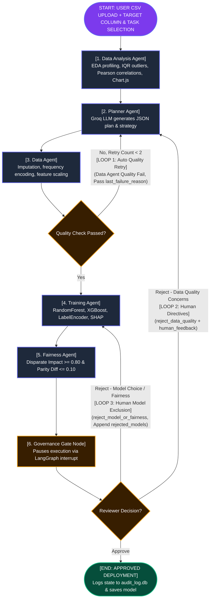

# AegisML: Autonomous Multi-Agent AI Data Science & Governance Platform

[](https://python.org)
[](https://fastapi.tiangolo.com)
[](https://langchain.com)
[](https://groq.com)
[](https://sqlite.org)

**AegisML** is an enterprise-grade, state-checkpointed multi-agent machine learning platform designed to bridge automated AI data science with human governance, algorithmic fairness auditing, and immutable compliance logging.

---

## 🌟 Architecture & Key Highlights

- **6 Specialized Pipeline Nodes**: Seamlessly orchestrates Exploratory Data Analysis, LLM Model Strategy Planning, Deterministic Data Cleaning, Ensemble Model Training & SHAP, Subgroup Fairness Auditing, and Governance Gate Interrupts.
- **State Checkpointing & Resumption**: Built on **LangGraph** with a persistent SQLite checkpointer (`pipeline_state.db`), enabling crash-recovery and zero-latency human-in-the-loop interrupts.
- **Human-in-the-Loop Governance Gates**: Pauses execution before model deployment to present evaluation reports to human auditors with custom prompt directive injection and model candidate exclusion.
- **3-Loop Resilience System**: Features automated quality retry loops and two interactive human reroute loops.
- **Tamper-Evident Audit Logger**: Every agent execution event, metric evaluation, and human reviewer decision is appended to `audit_log.db`, each entry SHA-256 hashed together with its predecessor. `verify_audit_chain()` re-derives the chain and reports the exact entry at which any edit, deletion or reordering occurred. See [Audit Chain Guarantees](#-audit-chain-what-is-and-is-not-guaranteed) for what this does and does not prove.
- **No Train/Test Leakage**: The train/test split is drawn by the Data Agent *before* any parameter is fitted. Imputation fill values, frequency-encoding maps and the feature scaler are all learned from the train rows only; fairness is measured on the held-out rows.

---

## 🔄 Multi-Agent DAG Topology & Looping Mechanics

### Pipeline Architecture Flowchart



### 6 Pipeline Agent Nodes

1. **`Data Analysis Agent` (`data_analysis_agent.py`)**: Performs initial exploratory data profiling, computing missingness ratios, column summary statistics, IQR outliers, Pearson correlation matrices ($|r| \ge 0.20$), target distributions, and interactive Chart.js visualization payloads.
2. **`Planner Agent` (`planner_agent.py`)**: Uses Groq LLM (`openai/gpt-oss-20b` by default; override with the `GROQ_MODEL` env var) in JSON mode at `temperature=0.2`. Only aggregate statistics are sent — never raw rows. Column metadata is capped at 40 representative columns (target, sensitive and high-null columns prioritised) to stay inside the request size limit on wide datasets. The response is validated against 5 required keys, with one retry on parse failure.
3. **`Data Agent` (`data_agent.py`)**: Executes deterministic data cleaning. Drops columns above 50% missing and rows with a null target, then **draws the train/test split** and fits every subsequent parameter — median/mode imputation, frequency-encoding maps, `StandardScaler` — on the train rows only, applying them to all rows. Returns `train_index` / `test_index` so the Training Agent reuses the identical split.
4. **`Training Agent` (`training_agent.py`)**: Converts target `y` using `LabelEncoder` (0..N-1) for 100% XGBoost compatibility across binary and multi-class tasks. Fits ensemble models (`RandomForest`, `XGBoost`, `LogisticRegression`/`Ridge`), ranks leaderboards, and extracts top-5 SHAP feature importances.
5. **`Fairness Agent` (`fairness_agent.py`)**: Evaluates subgroup equity across demographic candidates (gender, race, age) on the **held-out test rows**, enforcing Disparate Impact ($\ge 0.80$) and Demographic Parity Difference ($\le 0.10$). One-hot-encoded attributes are reconstructed by prefix matching. Regression tasks and runs where no candidate resolves to a usable subgroup column return `overall_fairness_passed = None` with `fairness_evaluated = False` — reported in the dashboard as **NOT EVALUATED**, never as a pass.
6. **`Governance Gate Node` (`pipeline_graph.py`)**: Calls `interrupt(payload)`, pausing graph execution to present evaluation reports to human auditors on the web dashboard.

### 3-Loop Resilience System

- **Loop 1: Automated Data Quality Retry Loop**: If `Data Agent` detects `quality_check_passed == False` (e.g. unhandled missing values $>5\%$), it automatically loops back to `Planner Agent` (max 2x) passing `last_failure_reason`.
- **Loop 2: Human Data Directives Loop**: If a human reviewer selects **Reject (Data Quality)** with optional custom text directives (`human_feedback`), execution reroutes to `Planner Agent`, injecting instructions into the Groq LLM system prompt.
- **Loop 3: Human Model Exclusion Loop**: If a human reviewer selects **Reject (Model Choice / Fairness)**, the currently winning model is added to `rejected_models`, and execution reroutes to `Training Agent` to train and select the next best algorithm.

---

## 🖼️ Visual Feature Walkthrough

### 1. Dataset Upload & Pipeline Setup
Upload any tabular CSV dataset, select target column (with auto-detected classification or regression task type), and view real-time DAG node execution status.


---

### 2. Exploratory Data Profiling
Dedicated **Data Analysis & Profiling** dashboard page displaying summary KPI banners, column data types, null counts, cardinality, range, mean, std, and IQR outlier detection.


---

### 3. Interactive Data Analysis Visualizations (Chart.js)
Real-time visual chart panels rendering target class/value distribution histograms, top feature correlation strength bars, and data quality ratios.


---

### 4. LLM Model Strategy & Proposal
Groq LLM-generated plan displaying data quality concerns, recommended preprocessing steps, model algorithms, and sensitive attribute candidates.


---

### 5. Governance Gate & Human-in-the-Loop Decision Panel
Paused pipeline execution checkpoint giving human auditors 3 governance decision paths: **Approve**, **Reject Data Quality** (with custom text prompt directives), or **Reject Model Choice** (with candidate exclusion).


---

### 6. Resumed Execution & Pipeline State Progress
Real-time topology status updating as the graph resumes execution following a governance decision.


---

### 7. Approved Model Deployment & Disk Serialization
Formally approves the winning model. `audit_log_node` writes the serialised `.joblib` artifact to `saved_models/<run_id>_<model>.joblib` and records the real path in both the pipeline state and the audit entry; the dashboard displays that path, or an explicit **NOT SAVED** message with the failure reason. Serialisation happens only on the approve path — a model rejected at the gate never reaches disk.


---

### 8. Immutable Governance Audit Trail
Chronological event audit log persisted into SQLite (`audit_log.db`), recording agent events, metrics, human reviewer decisions, and feedback text.


---

### 9. System Pipeline Architecture Flow Reference


---

## 🚀 Quickstart & Local Installation

### Prerequisites

- Python 3.9+ installed
- Groq API Key ([Get Groq Key](https://console.groq.com))

### 1. Clone & Setup Environment

```bash
git clone https://github.com/ruhannpn/AegisML.git
cd AegisML

# Create virtual environment
python3 -m venv .venv
source .venv/bin/activate

# Install dependencies
pip install -r requirements.txt
```

### 2. Configure Environment Variables

Create a `.env` file in the root directory:

```env
GROQ_API_KEY=your_groq_api_key_here
```

### 3. Run Web Application

```bash
python server.py
```

Open your browser and navigate to:
```text
http://localhost:8000
```

---

## 📁 Repository Structure

```text
├── server.py                   # FastAPI REST application & endpoint handlers
├── pipeline_graph.py           # LangGraph stateful DAG orchestration & interrupt logic
├── graph_state.py              # PipelineState TypedDict & DataFrame serialization helpers
├── data_analysis_agent.py      # Exploratory Data Analysis profiler & Chart.js generator
├── planner_agent.py            # Groq LLM metadata reasoning agent & prompt compression
├── data_agent.py               # Deterministic data cleaning, imputation & scaling agent
├── training_agent.py           # LabelEncoding, ensemble training, leaderboard & SHAP agent
├── fairness_agent.py           # Demographic subgroup equity auditing agent
├── audit_log.py                # Immutable SQLite audit logger (audit_log.db)
├── static/
│   └── index.html              # Dark slate glassmorphism web UI with Chart.js
├── images/                     # Screenshot documentation assets
└── saved_models/               # Serialized joblib production model artifacts
```

---

## 🔐 Audit Chain: What Is and Is Not Guaranteed

Each audit entry stores `entry_hash = SHA-256(canonical(entry) + entry_hash_of_predecessor)`, anchored per run at a genesis constant.

**Detected by `verify_audit_chain(run_id)`:**
- Any edit to a logged field — summary, details, timestamp, `event_source`.
- Deletion of an entry from the middle of a run.
- Insertion of a forged entry, or reordering (the sequence number is hashed).

**NOT detected — stated plainly rather than assumed away:**
- **Truncation.** Deleting *trailing* entries leaves a shorter but internally consistent chain. Nothing inside the database can prove entries once existed beyond its own head.
- **Deletion of an entire run.**
- **Wholesale recomputation.** The chain is unsigned, so anyone who can write to the file can rebuild a valid chain over falsified content.

Closing those requires an anchor *outside* the file — periodically publishing the head hash to an append-only location, or signing entries with a key the database host does not hold. That is the intended next step and is deliberately not claimed here.

---

## 🧪 Tests

```bash
pytest
```

The suite in `tests/` is fully offline: synthetic fixtures, a stubbed planner, no Groq key and no network. It covers the leakage boundary, the audit chain (including tampering and the documented truncation gap), fairness reporting honesty, and an end-to-end graph run through interrupt, resume and both reroute loops.

The `test_*.py` scripts in the repository root are the original manual integration walkthroughs — they download the UCI Adult dataset and call the live Groq API, so they are run by hand and are excluded from `pytest` collection.

---

## 📜 License & Compliance

Developed for **Academic Review 2 Evaluation**.

The architecture is designed *against* the control objectives of the EU AI Act (human oversight, logging, technical documentation, data governance), the NIST AI RMF, and comparable corporate audit standards. It has **not** undergone conformity assessment, and no compliance claim is made — the governance controls are demonstrable, the certification is not.
