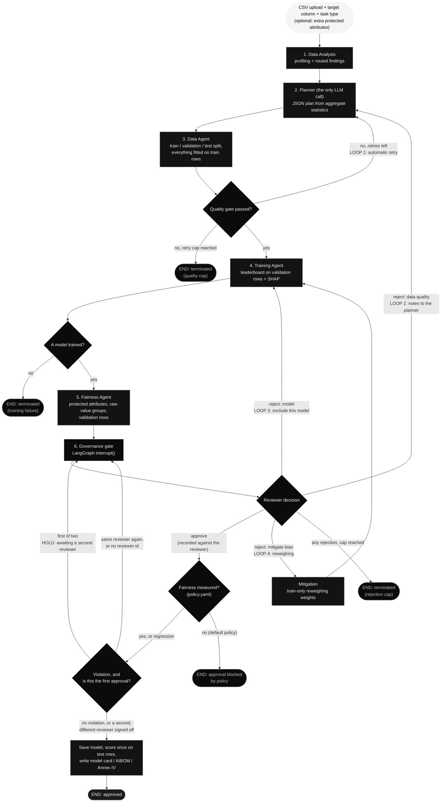
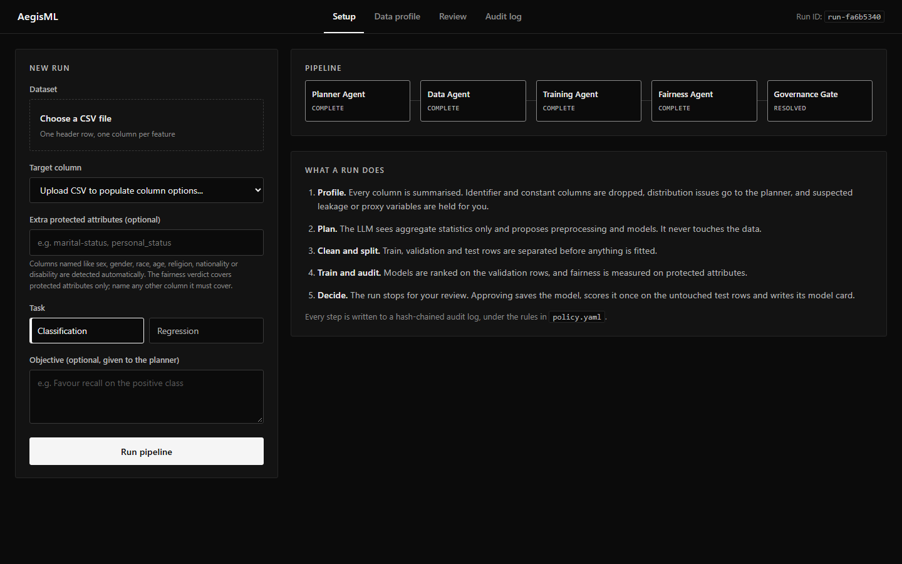
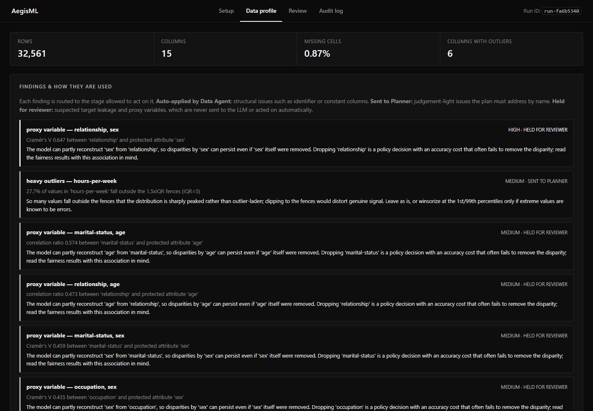
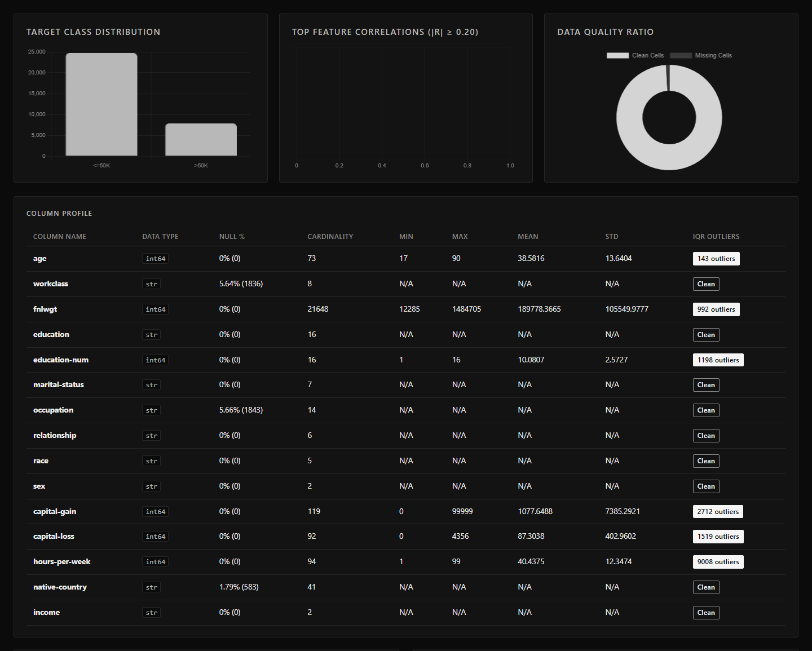
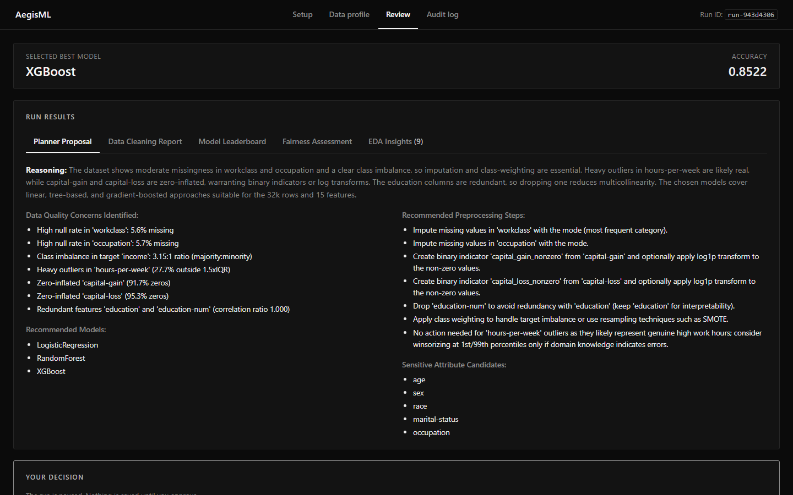
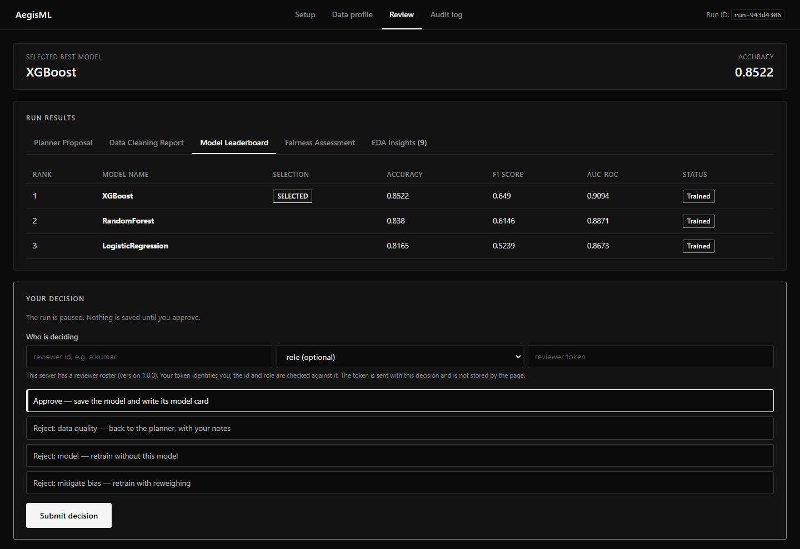
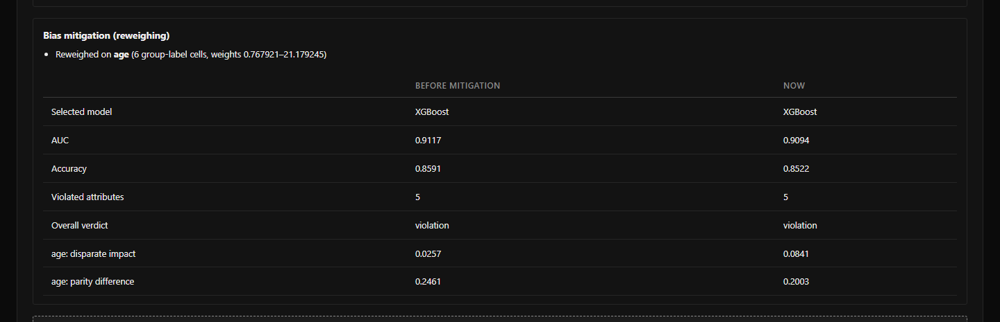
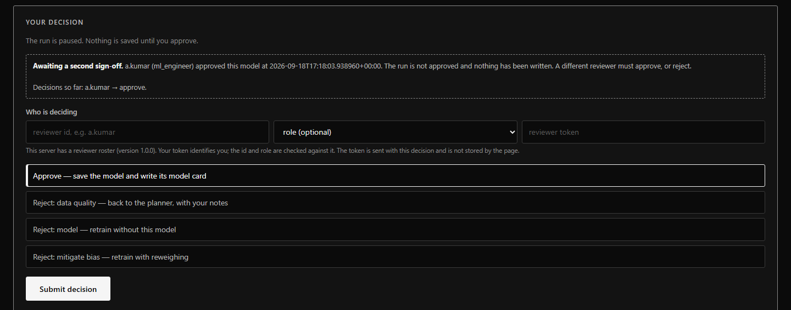
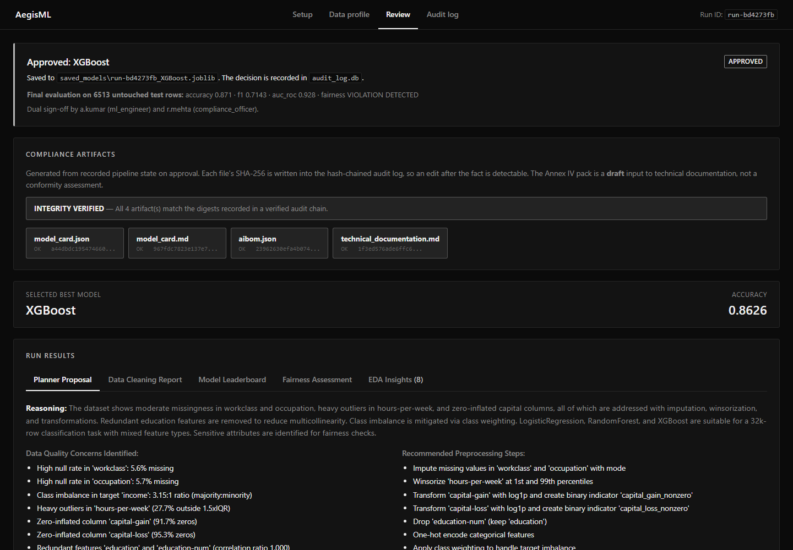
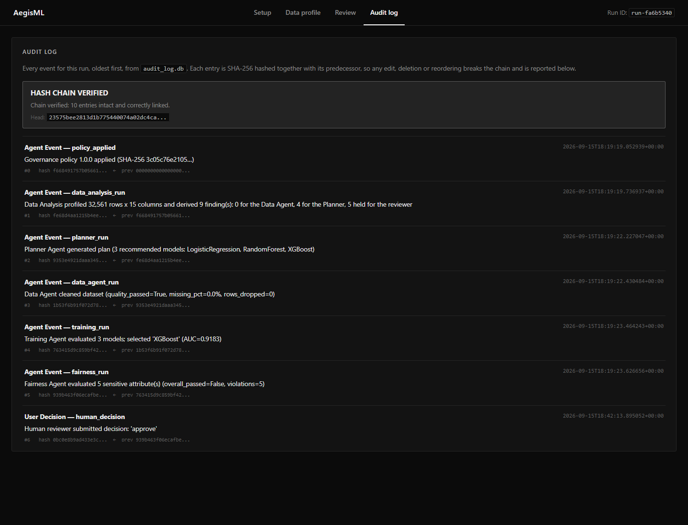

# AegisML: Autonomous Multi-Agent AI Data Science & Governance Platform

[](https://python.org)
[](https://fastapi.tiangolo.com)
[](https://langchain.com)
[](https://groq.com)
[](https://sqlite.org)

**AegisML** is a governed AutoML pipeline for tabular data. A LangGraph graph profiles an uploaded CSV, has an LLM plan the preprocessing from aggregate statistics, cleans the data deterministically, trains a model leaderboard, audits fairness on protected attributes, and then stops for a human decision. Every step goes to a hash-chained audit log, and an approved model ships with a model card, an AI Bill of Materials and a draft EU AI Act Annex IV pack.

---

## 🌟 Architecture & Key Highlights

- **A trust boundary around the LLM**: the planner is the only LLM call. It sees aggregates, never rows, and its plan is keyword-matched by deterministic code, never executed.
- **Checkpointed human gate**: built on **LangGraph** with a SQLite checkpointer (`pipeline_state.db`), so a run paused for review survives a server restart.
- **Four feedback loops and five endings**: an automatic data-quality retry, three reviewer rejections (data quality, model, and bias mitigation by reweighing), and runs that end approved or terminated by the quality cap, a training failure, the rejection cap, or the governance policy.
- **Honest fairness measurement**: groups come from raw uploaded values, the verdict covers protected attributes only, pairs of protected attributes are audited together, and a verdict that could not be measured is never shown as a pass.
- **No leakage, and an untouched test set**: train / validation / test rows are separated before anything is fitted. Every gate decision uses the validation rows; the approved model is scored once on the test rows.
- **Policy as code**: every threshold and rule lives in [`policy.yaml`](policy.yaml), validated at startup and recorded with a SHA-256 on every run. By default, a model whose fairness was not measured cannot be approved.
- **Named reviewers and dual sign-off**: every decision records who made it, and approving a model with a fairness violation takes two different reviewers. The second sign-off is a hold, not a loop: nothing is written until it arrives.
- **Tamper-evident audit log**: each entry in `audit_log.db` is SHA-256 hashed together with its predecessor. `verify_audit_chain()` names the first entry that was edited, deleted or reordered. See [Audit Chain Guarantees](#-audit-chain-what-is-and-is-not-guaranteed) for what this does and does not prove.

---

## 🔄 Multi-Agent DAG Topology & Looping Mechanics

### Pipeline Architecture Flowchart



### Pipeline stages

1. **Data Analysis (`data_analysis_agent.py`, `eda_insights.py`).** The first graph node profiles the raw data for the dashboard, then derives structured **findings**, each routed to the stage allowed to act on it:
   - identifier and constant columns go to the **Data Agent**, which drops them;
   - zero-inflated or outlier-heavy features, redundant pairs and a skewed target go to the **Planner**, which must address each by name;
   - suspected target leakage and **proxy variables** for protected attributes (Cramér's V / correlation ratio) are held for the **human reviewer** and never sent to the LLM.

   Every finding is shown at the gate with what each stage actually did with it. Columns the reviewer declares protected at run start take part in proxy detection too.
2. **Planner (`planner_agent.py`).** The only LLM call: Groq (`openai/gpt-oss-20b` by default, override with `GROQ_MODEL`), JSON mode, `temperature=0.2`. Only aggregate statistics are sent, never rows; column metadata is capped at 40 representative columns. The response is validated against its required keys, with one retry. Prompt hashes and token usage are recorded for the AIBOM, and a record/replay cache makes the evaluation reproducible without an API key.
3. **Data Agent (`data_agent.py`).** Deterministic cleaning. After structural drops, it draws a stratified **train / validation / test split (64 / 16 / 20)** before fitting anything; imputation values, frequency-encoding maps, winsorisation bounds and the scaler are all learned from train rows only. The planner's text is read by keyword rules (clauses, hedges, scope terminators), never executed. Limits come from `policy.yaml`.
4. **Training Agent (`training_agent.py`).** Trains the allowed models from the planner's recommendations (LogisticRegression, RandomForest, XGBoost, GradientBoosting; Ridge and Lasso for regression), ranks them on the **validation rows** and extracts top-5 SHAP features. It accepts per-row sample weights for mitigation. A run in which no model trains ends instead of reaching the gate.
5. **Fairness Agent (`fairness_agent.py`).** Audits the model on the validation rows:
   - **Groups come from the raw uploaded values**, not the cleaned data, so scaled or encoded columns (COMPAS `sex`, Adult `occupation`) are still audited; missing values form their own group; `age` is banded (<25, 25–59, 60+); groups under 30 rows are excluded and listed.
   - **The verdict covers protected attributes only**: columns named like sex, race, age and similar, plus any the reviewer declares. Other columns the planner proposes are audited and shown as **advisory**.
   - An attribute violates when disparate impact is below 0.80 or demographic parity difference is above 0.10. Equal-opportunity and equalized-odds gaps are reported alongside.
   - **Combined subgroups**: every pair of protected attributes (for example `sex × race`) is audited with the same rules and reported, but does not change the verdict.
   - The verdict has three states: passed, violation, or `None`. `None` is **NOT EVALUATED** (nothing protected could be measured) or **NOT FULLY EVALUATED** (a protected attribute in the data could not be audited), and it is never shown as a pass.
6. **Governance gate (`pipeline_graph.py`).** Calls `interrupt(payload)` and waits. The reviewer can approve, reject for data quality, reject the model, or ask for mitigation. Every decision is recorded against the identity that submitted it. Approving saves the model, scores it once on the untouched test rows, and writes the compliance artifacts — unless the model violates fairness, in which case the first approval only opens the gate again for a second, different reviewer.
7. **Mitigation (`mitigation.py`).** Triggered only by the reviewer. It reweights training rows so the label is independent of the worst-violating protected attribute (reweighing: P(group) × P(label) / P(group, label), computed on train rows only), then retrains the same candidates. The next gate shows before against now. A second mitigation reweights the intersection of both attributes.
8. **Reviewer identity (`reviewers.py`, `reviewers.yaml`).** Optional roster mapping a bearer token to a reviewer id and role. With it, the `X-Reviewer-Token` header decides who a decision belongs to; without it the caller's stated id is recorded as **unverified**. Either way an id is required, and the same reviewer cannot supply both sign-offs. See "Who approved" below for the threat model.
9. **Governance policy (`policy.py`, `policy.yaml`).** Validated at startup, recorded per run, and read by every stage above; see the Governance Policy section below.

### Feedback loops and endings

- **Loop 1: automatic retry.** If the Data Agent's quality gate fails, the run goes back to the Planner with the failure reason, up to 2 times.
- **Loop 2: reject — data quality.** Back to the Planner, with the reviewer's notes injected into the prompt.
- **Loop 3: reject — model.** The selected model is excluded and training runs again on the remaining candidates.
- **Loop 4: reject — mitigate bias.** Reweighing on the worst-violating protected attribute, then training runs again on the same candidates.

**Not a loop: the second sign-off.** Approving a model with a fairness violation sends the run
back to the same gate marked *awaiting a second sign-off*. It costs no reroute, excludes no
model and retrains nothing — the same model and the same evidence are shown to a second
reviewer, who may approve or reject. An approval from the first approver again, or one with no
reviewer id, is logged and refused.

Loops 2–4 share one rejection cap (2 by default). A run ends in one of five ways: **approved**, or terminated by the **quality cap**, a **training failure**, the **rejection cap**, or the **approval block**: if a classification model's fairness could not be measured, the policy refuses the approval and the run ends without a model. Every terminated run shows a "Run ended without approval" banner with its reason, never an approved one.

---

## 🖼️ Dashboard Walkthrough

Screenshots from real UCI Adult Income runs. Any recorded run opens directly from a link such
as `http://localhost:8000/#run=<run id>&page=review&tab=tab-fairness`, where `page` is `setup`,
`profile`, `review` or `audit`.

### 1. Setup
Upload a CSV, choose the target column and task, and optionally name extra protected attributes
(for example `personal_status`). The pipeline strip shows each stage's status; the panel beside it
says what a run does.



### 2. Data profile
Dataset figures, then every exploratory finding with the stage it was routed to. Here
`relationship` and `marital-status` stand in for `sex` and `age`, so they are held for the
reviewer rather than sent to the LLM.



The target distribution, top correlations, data quality ratio and the per-column profile. The
correlation chart is empty here because no pair of numeric Adult features reaches |r| ≥ 0.20.



### 3. Planner proposal
The LLM's reasoning, the data quality concerns it identified, the preprocessing it recommends
and the attributes it considers sensitive. The Data Agent applies only its unconditional steps.



### 4. Leaderboard and your decision
Models ranked on the validation rows. The run is paused until you approve, reject for data
quality, reject the model, or ask for bias mitigation. Every decision is submitted under a
reviewer id — and a token, if this server has a roster.



### 5. Fairness assessment
The verdict covers protected attributes only. `age`, `sex` and `race` violate (solid white
labels); `marital-status` and `occupation` are advisory (dashed); `native-country` could not be
audited and is named. Below the table, combined subgroups such as `age × sex` are reported
without changing the verdict.


### 6. Bias mitigation
After "Reject: mitigate bias", the next gate shows what was reweighted and the numbers before
mitigation against now.



### 7. Second sign-off
This model violates fairness on a protected attribute, so the first approval did not finish the
run. The gate re-opens naming who approved and when; nothing has been saved, and the second
sign-off has to come from a different reviewer.



### 8. Approved
The second reviewer's approval saves the model, scores it once on the untouched test rows, and
writes its model card, AIBOM and Annex IV draft. Each artifact's SHA-256 is checked against the
audit chain, and the banner names both approvers.



### 9. Audit log
Every event for the run, starting with the governance policy that applied, each hashed together
with its predecessor. The banner re-verifies the chain.



---

## 🚀 Quickstart & Local Installation

### Prerequisites

- Python 3.9+ installed
- Groq API Key ([Get Groq Key](https://console.groq.com))

### 1. Clone & Setup Environment

```bash
git clone https://github.com/ruhannpn/AegisML.git
cd AegisML

# Create virtual environment
python3 -m venv .venv
source .venv/bin/activate

# Install dependencies
pip install -r requirements.txt
```

### 2. Configure Environment Variables

Create a `.env` file in the root directory:

```env
GROQ_API_KEY=your_groq_api_key_here
```

### 3. Optional: authenticate reviewers

Copy `reviewers.example.yaml` to `reviewers.yaml` (gitignored) and give each reviewer a token
from `python reviewers.py --new-token`. Decisions then require an `X-Reviewer-Token` header and
are recorded under the id that token belongs to. Without this file the pipeline still requires
a reviewer id and still needs two different ones to approve a violating model — it simply
records them as unverified.

### 4. Run Web Application

```bash
python server.py
```

Open your browser and navigate to:
```text
http://localhost:8000
```

---

## 📁 Repository Structure

```text
├── server.py                   # FastAPI app: start / resume / status / EDA / audit / artifact endpoints
├── pipeline_graph.py           # LangGraph graph: nodes, routers, loops, approval block, checkpointer
├── graph_state.py              # PipelineState TypedDict and serialisation helpers
├── data_analysis_agent.py      # Raw data profiling and chart payloads
├── eda_insights.py             # Routed findings, proxy and leakage detection, protected-attribute names
├── planner_agent.py            # The only LLM call; prompt provenance; record/replay cache
├── data_agent.py               # Train/validation/test split, train-only fitting, plan-step parser
├── training_agent.py           # Model registry, validation-row leaderboard, SHAP, sample weights
├── fairness_agent.py           # Raw-value groups, protected-only verdict, combined subgroups
├── mitigation.py               # Reweighing for the "reject and mitigate" decision
├── audit_log.py                # Append-only, SHA-256 hash-chained audit log and verification
├── compliance_artifacts.py     # Model card, AIBOM, Annex IV draft, artifact verification
├── policy.py                   # Policy loader: validation, version, SHA-256
├── policy.yaml                 # Thresholds and governance rules
├── reviewers.py                # Reviewer roster: token to id/role, strict validation
├── reviewers.example.yaml      # Template roster (the real one, reviewers.yaml, is gitignored)
├── static/
│   └── index.html              # Dashboard (vanilla JS + Chart.js)
├── tests/                      # Offline pytest suite (279 tests)
├── experiments/
│   ├── run_governance_eval.py  # Governance evaluation harness (record / replay / --summarise-only)
│   ├── planner_cache/          # Recorded planner responses, so results reproduce without a key
│   └── results/                # Committed results: runs, per-gate trajectory, summary, figures
├── images/                     # Dashboard screenshots used in this README
├── app.py                      # Superseded Streamlit UI
└── test_*.py                   # Original manual scripts (live Groq and network; not run by pytest)
```

Created at runtime and gitignored: `.env`, `reviewers.yaml`, `pipeline_state.db`, `audit_log.db`, `saved_models/`, `artifacts/`.

---

## 📊 Evaluation: Do the Governance Loops Change Outcomes?

`experiments/run_governance_eval.py` drives the real pipeline end to end with a scripted
reviewer: **4 datasets × 4 arms × 5 train/test split seeds = 80 runs**.

| Arm | Reviewer |
|---|---|
| **A** governance off | No automatic data-quality retry; approve at the first gate |
| **B** auto-retry | Automatic retry enabled; approve at the first gate |
| **C** fairness reviewer | Reject the model while a fairness violation remains (up to 2 reroutes) and take the next-best model, otherwise approve |
| **D** mitigation reviewer | As C, but each rejection is *reject and mitigate*: the same candidates are retrained with reweighing on the worst-violating protected attribute |

**How the numbers are produced.** The Data Agent splits train / validation / test
(64 / 16 / 20). Every gate decision — the leaderboard, the fairness audit, each rejection
and mitigation — uses the validation rows. The approved model is then scored once on the
untouched test rows, and **every number below comes from that final test evaluation**. The
fairness verdict and these columns cover **protected attributes only** (sex, race, age and
similar); attributes the planner proposes that are not protected, such as `occupation` or
`education`, are still audited and reported as advisory.

Means over 5 seeds, shown as **A/B · C · D**. Arms A and B were identical on every run, so
they share a value.

| Dataset | AUC (test rows) | Violated protected attributes | Min disparate impact | Max parity difference |
|---|---|---|---|---|
| UCI Adult (48,842) | 0.926 · 0.877 · 0.923 | 3.0 · 3.0 · 3.0 | 0.018 · 0.034 · 0.073 | 0.246 · 0.250 · 0.202 |
| German Credit (1,000) ‡ | — | — | — | — |
| Bank Marketing (45,211) | 0.746 · 0.724 · 0.742 | 1.0 · 1.0 · 1.0 | 0.177 · 0.146 · 0.239 | 0.127 · 0.206 · 0.083 |
| COMPAS (5,278) | 0.724 · 0.666 · 0.709 | 4.0 · 3.6 · 3.2 | 0.184 · 0.364 · 0.416 | 0.619 · 0.391 · 0.231 |

‡ No German Credit model was approved. On every split the gate could not audit a protected
attribute, and the governance policy blocks approving a model whose fairness was not
measured; see finding 4.

**Findings.**

1. **No approved model passed.** 60 of 80 runs ended with an approved model, and all 60
   violated on a protected attribute on their test rows. The other 20 — every German Credit
   run — ended with approval blocked by the governance policy (finding 4).
2. **Rejecting a model and taking the next best is not a fairness intervention.** Arm C
   rerouted 15 of 20 runs; in all 15 the approved model had the same number of violated
   protected attributes as the first. It cost test AUC on every dataset it touched: −0.049 on
   Adult, −0.022 on Bank Marketing, −0.058 on COMPAS.
3. **Reweighing did more, for much less, but did not make models compliant.** Arm D also
   rerouted 15 of 20 runs; the approved model had fewer violated protected attributes in 4
   (all COMPAS), the same in 11, and more in none. Test AUC fell by only 0.003 on Adult, 0.004
   on Bank Marketing and 0.015 on COMPAS. On COMPAS, min disparate impact rose from 0.18 to
   0.42 and max parity difference fell from 0.62 to 0.23; on Adult min DI rose from 0.018 to
   0.073. Every run still violated: two reweighings, capped by two reroutes, cannot close gaps
   this large.
4. **The gate cannot act on what its validation rows cannot measure — so the policy refuses
   to approve.** On German Credit's 160-row validation split, no protected attribute could be
   audited at the gate on any of the 5 seeds (the age bands never reached 30 rows, and `job`
   is advisory), so every gate verdict was NOT EVALUATED. Before the approval block, all four
   arms approved those models anyway, and the untouched test rows then showed age violations
   on 3 of 5 seeds (results at `d81faa2`): reviewers had approved blind. Under the governance
   policy's default, approving a model whose fairness was not measured is refused, so all 20
   German Credit runs end without an approved model. The underlying problem — a validation
   split too small to audit a small dataset's protected groups — is still open.
5. **Gate numbers are optimistic, as they should be expected to be.** Models are chosen on the
   validation rows, so the gate overstates the test result: COMPAS 0.735 at the gate against
   0.724 on test (arms A/B), and German Credit 0.805 against 0.780 in the run before the
   approval block. Compared with `75b96c9`, which ranked models on the test rows, ranking on
   validation rows changed the selected model in 16 of 40 arm A/B runs.
6. **The automatic data-quality retry never engaged.** Benchmark data passes the quality
   gate first time, so arms A and B coincide. That loop is exercised only by the synthetic
   tests.
7. **The evaluation found pipeline defects**, all fixed before these results: XGBoost
   silently failed wherever category values contain `[`, `]` or `<` (German Credit); a run
   with no trained model could reach the gate, be approved, and receive a model card; and the
   Fairness Agent itself was not fit to report (next section).

**The first run understated disparity.** The evaluation was first run with a Fairness Agent
that read groups from the *cleaned* frame and had no minimum group size. It was corrected and
the evaluation re-run from the same planner cache; arms A and B selected the same model with
the same AUC on all 40 runs, so every change is in the measurement, not the models.

- Groups now come from raw uploaded values. COMPAS `sex` (0/1, standardised by the Data
  Agent) and Adult `occupation` (frequency-encoded) had been skipped as "continuous"; both
  are now audited.
- `age` is audited in bands (<25, 25–59, 60+). It was never audited before, on any dataset.
- Groups with fewer than 30 evaluation rows are excluded from the comparison and listed.
- Protected attributes present in the data are audited even when the planner omits them.
- The equal-opportunity difference (true-positive-rate gap) is reported alongside, but is
  not part of the verdict.

Violated attributes per run rose from 3.0 to 5.0 on Adult, 2.0 to 4.0 on COMPAS and 1.6 to
2.6 on Bank Marketing, and minimum DI fell on all three. German Credit's minimum DI rose
slightly (0.771 → 0.798) once a 5-row `job` group was excluded.

**Read these numbers with their caveats.**

- **Adult's minimum disparate impact is `age`**, a protected attribute: under-25s (about
  1,700 test rows) receive a positive prediction under 1% of the time, against about 25% for
  ages 25–59. Arm D reweighed `age` and then `race`; `age` improved (0.018 → 0.073) but stayed
  far below 0.80. The earlier near-zero minimum from `occupation = "Priv-house-serv"` is now
  advisory, because `occupation` is not protected.
- **Advisory attributes still show disparities.** Adult averages 2.0 advisory violations per
  run (`occupation`, `marital-status`) and Bank Marketing 2.0 (`education`, `marital`). They
  are reported in `runs.csv` and on the dashboard, but they do not fail a model. Marital
  status is a protected characteristic in some jurisdictions; a reviewer can declare it
  protected at run start.
- **The previous results used the test rows at the gate and counted every audited
  attribute.** They are in git history at `75b96c9`; the numbers above are not comparable
  with them one-for-one.
- **Small datasets are hard to audit at all.** German Credit's age bands reach 30 rows in the
  200-row test split on only 3 of 5 seeds, and never in the 160-row validation split.
- **Protected attributes are recognised by column name** unless the reviewer declares more.
  German Credit's `personal_status` combines sex and marital status and is only audited when
  declared; the scripted reviewers here declare nothing.
- **Intersectional subgroups** (for example `sex × race`) are audited and shown on the
  dashboard and in the model card, but are reported only and not part of these results.
- **COMPAS `sex` is coded 0/1, and OpenML does not document which value is which.** Value 1
  is 80.5% of rows, which matches the dataset's known male share, but that is an inference.
  The groups are reported as "0" and "1".
- Seeds vary the train/test partition only. Model seeds are fixed, and the planner is held
  fixed per prompt, so arm differences reflect the governance loops, not LLM sampling
  variance.
- For COMPAS the positive class is the *adverse* outcome (predicted recidivism).

<picture>
  <source media="(prefers-color-scheme: dark)" srcset="experiments/results/fairness_vs_auc_dark.png">
  
</picture>

Full tables with standard deviations, the per-gate trajectory and the run manifest:
[`experiments/results/summary.md`](experiments/results/summary.md).

**Reproduce it — no Groq key needed.** The planner's responses are recorded in
`experiments/planner_cache/`. This command re-runs all 80 pipelines against them (about
16–27 minutes depending on the machine; datasets are fetched from OpenML on first use):

```bash
python experiments/run_governance_eval.py
```

This was verified on the first, 60-run evaluation: a full replay with a deliberately
invalid `GROQ_API_KEY` served all 60 planner calls from cache and reproduced `runs.csv` and
`fairness_trajectory.csv` **exactly**, on every deterministic column. The current 80-run
replay served 80 of 80 planner calls from cache with 0 errors, and every approved run was
reported on its test rows. To rebuild only the tables and figure from the
saved CSVs, in seconds:

```bash
python experiments/run_governance_eval.py --summarise-only
```

These results were produced from commit `c31f06a` on a clean working tree, under `policy.yaml`
version 1.1.0 (SHA-256 `cbed6975…`, recorded in the manifest). Dual sign-off applies to them:
the scripted reviewer signs with two identities, and `runs.csv` records both in `approvers`.
**Every one of the 60 approvals is an approval of a model with a fairness violation, and every
one of them now took two reviewers** — the rule slows the decision down; it does not, on this
evidence, change it. Compared with the run before reviewer identity existed, all 80 runs are
identical except one AUC in the fourth decimal (COMPAS arm C, seed 42: 0.6671 → 0.6670).
Earlier results remain in git history: the first run at `363ce53`, the corrected-metrics run at
`ab2d12f`, the first arm-D run (test rows at the gate, every audited attribute in the verdict)
at `75b96c9`, the run before the approval block at `d81faa2`, and the first run under the policy
at `f420d48` — whose manifest says `git_dirty: true` because the harness then checked the tree
after writing its own result files, which is fixed here.

---

## 🔐 Audit Chain: What Is and Is Not Guaranteed

Each audit entry stores `entry_hash = SHA-256(canonical(entry) + entry_hash_of_predecessor)`, anchored per run at a genesis constant.

**Detected by `verify_audit_chain(run_id)`:**
- Any edit to a logged field — summary, details, timestamp, `event_source`.
- Deletion of an entry from the middle of a run.
- Insertion of a forged entry, or reordering (the sequence number is hashed).

**NOT detected — stated plainly rather than assumed away:**
- **Truncation.** Deleting *trailing* entries leaves a shorter but internally consistent chain. Nothing inside the database can prove entries once existed beyond its own head.
- **Deletion of an entire run.**
- **Wholesale recomputation.** The chain is unsigned, so anyone who can write to the file can rebuild a valid chain over falsified content.

Closing those requires an anchor *outside* the file — periodically publishing the head hash to an append-only location, or signing entries with a key the database host does not hold. That is the intended next step and is deliberately not claimed here.

---

## 📄 Compliance Artifacts

Approving a model writes `artifacts/<run_id>/`:

| File | What it is |
|---|---|
| `model_card.md` / `.json` | Model details, intended use, training-data characteristics, held-out metrics, fairness results, SHAP features, the full human decision history, and explicit limitations |
| `aibom.json` | AI Bill of Materials: dataset SHA-256, model SHA-256, Python and library versions, planner model id and prompt hashes, token usage, audit chain head |
| `technical_documentation.md` | Draft documentation laid out under the nine EU AI Act Annex IV headings |

The model card also lists every exploratory finding and how it was used.

Every field is read from recorded pipeline state — **nothing in these documents is
LLM-authored**, so they cannot describe a metric the run never produced. Where a
value is absent it is marked `not recorded` rather than left plausibly blank.

The SHA-256 of each file is written into the hash-chained audit log as a
`compliance_artifacts_generated` event, which makes the paperwork itself
tamper-evident: `verify_artifacts(run_id)` re-hashes the files and compares them
against the digests recorded in the chain. The dashboard surfaces the result, and
the API refuses (HTTP 409) to serve an artifact that fails verification.

**Scope, stated plainly.** `technical_documentation.md` follows the Annex IV
*headings* so a reviewer can see which obligations the system holds evidence for
and which it does not. It is a draft input to technical documentation, not a
conformity assessment. Sections 8 (EU declaration of conformity) and 9 (post-market
monitoring) are reported as out of scope and not implemented respectively, because
they are.

---

## ⚖️ Governance Policy

Every threshold and governance rule a reviewer might ask about lives in
[`policy.yaml`](policy.yaml): the Data Agent's missing-value and quality limits, the
train/validation/test sizes, the fairness thresholds and minimum group size, the retry and
rejection caps, an allowed-models list, and whether a model whose fairness was not measured
may be approved.

- **Fails loudly.** An unknown key, a wrong type, an out-of-range value or an unknown model
  name stops the server at startup rather than silently falling back to a default.
- **Recorded per run.** Each run carries the validated policy, its `version` and a SHA-256
  of its values. The first audit entry (`policy_applied`) holds the full policy; the final
  outcome, the AIBOM and the model card name its version and hash.
- **Approving an unevaluated model is blocked by default.** If a classification model's
  fairness verdict is NOT EVALUATED or NOT FULLY EVALUATED, Approve is disabled with the
  reason, the API refuses it (HTTP 409), and the pipeline itself refuses it. The
  evaluation showed why: on German Credit the gate could not audit any protected attribute,
  and reviewers approved models whose fairness had never been measured. Set
  `block_approval_when_fairness_not_evaluated: false` to allow it. Regression has no
  fairness definition and is exempt.
- **Approving a violating model takes two reviewers.**
  `require_dual_signoff_for_violating_approval` (on by default) holds the run at the gate after
  the first approval. `dual_signoff_can_override_approval_block` (off by default) decides
  whether two reviewers may instead sign off a model whose fairness could not be measured — the
  only way to get past the block, and off unless someone chooses otherwise.

---

## 🖊️ Who Approved: Reviewer Identity and Dual Sign-Off

An approval with no approver is not an audit trail. Every decision now carries a `reviewer_id`
and an optional role, both written into the `human_decision` audit event, the model card's
decision history and the AIBOM.

- **Two people for a violating model.** If the fairness verdict is a violation, the first
  approval is logged as `signoff_first_approval` and the gate re-opens. The API refuses a second
  approval from the same reviewer (HTTP 409), and so does the graph, which logs the attempt as
  `signoff_rejected` and returns to the gate. An approval with no reviewer id is refused the same
  way. Both identities appear in the final outcome and the model card's sign-off table.
- **Authentication, stated honestly.** With a `reviewers.yaml` roster, a decision must carry the
  `X-Reviewer-Token` header; the token decides the identity, and a `reviewer_id` in the body has
  to agree with it. Tokens are held only as SHA-256 digests and compared with `compare_digest`.
  **This is a shared secret in a local file over HTTP: no expiry, no revocation, no rotation, no
  transport security, and anyone who can read the file or write to the databases can defeat it.**
  It establishes that two sign-offs came from two different token holders, and claims nothing
  more. Without a roster, identities are recorded as UNVERIFIED and the model card says so in its
  limitations.
- **CORS.** Browser origins are restricted to an explicit list (override with
  `AEGISML_ALLOWED_ORIGINS`), and credentialed CORS stays off because the token travels in a
  header rather than a cookie.

---

## 🧪 Tests

```bash
pytest
```

The suite in `tests/` is fully offline: synthetic fixtures, a stubbed planner, no Groq key and no network. **279 tests**, and a GitHub Actions workflow runs them on every push.

| File | Tests | Covers |
|---|---:|---|
| `test_eda_insights.py` | 56 | Finding routes, proxy detection, plan-step parsing against real planner phrasings, a captured prompt proving reviewer findings never reach the LLM |
| `test_governance_eval.py` | 44 | Record/replay cache, scripted reviewers for all four arms, metrics, CSV round trip, summaries, charts |
| `test_fairness_groups.py` | 29 | Minimum group size, raw-value groups, age bands, protected-only verdict, declared attributes, coverage rule |
| `test_policy.py` | 25 | Policy validation and hashing, thresholds changing behaviour, approval block, regression exemption |
| `test_reviewers.py` | 15 | Roster validation, duplicate ids and reused tokens, hashed tokens, identification |
| `test_graph_end_to_end.py` | 19 | Interrupt/resume, every reroute loop, caps, training failure, model saving, artifacts, audit chain |
| `test_compliance_artifacts.py` | 18 | Artifact contents, NOT EVALUATED wording, digests, tamper detection |
| `test_leakage.py` | 13 | Split before fit; parameters learned from train rows only |
| `test_audit_chain.py` | 12 | Hash chain, edit/delete/reorder detection, the documented truncation gap |
| `test_mitigation.py` | 12 | Weight arithmetic, train-only fitting, attribute choice, the graph path, the model card |
| `test_validation_split.py` | 7 | Three-way split, gate on validation rows, one final scoring on test rows |
| `test_intersectional.py` | 6 | Combined subgroups: hidden disparities, small combinations, never in the verdict |
| `test_feature_names.py` | 5 | XGBoost-safe one-hot column names |
| `test_fairness_honesty.py` | 3 | Unmeasured fairness never reported as passed |
| `test_dual_signoff.py` | 13 | One approval is not an approval, self sign-off refused, two reviewers in the artifacts, the policy switches |
| `test_completed_run.py` | 2 | A finished run keeps the payload its reviewer decided on |

The `test_*.py` scripts in the repository root are the original manual integration walkthroughs — they download the UCI Adult dataset and call the live Groq API, so they are run by hand and are excluded from `pytest` collection.

---

## 📜 License & Compliance

Developed for **Academic Review 2 Evaluation**.

The architecture is designed *against* the control objectives of the EU AI Act (human oversight, logging, technical documentation, data governance), the NIST AI RMF, and comparable corporate audit standards. It has **not** undergone conformity assessment, and no compliance claim is made — the governance controls are demonstrable, the certification is not.
